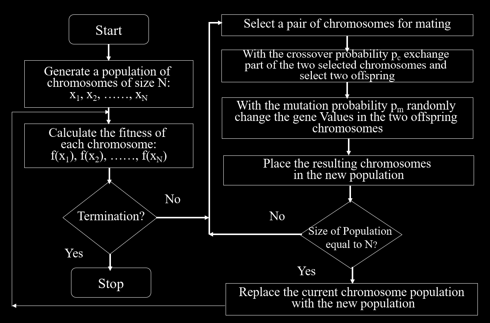
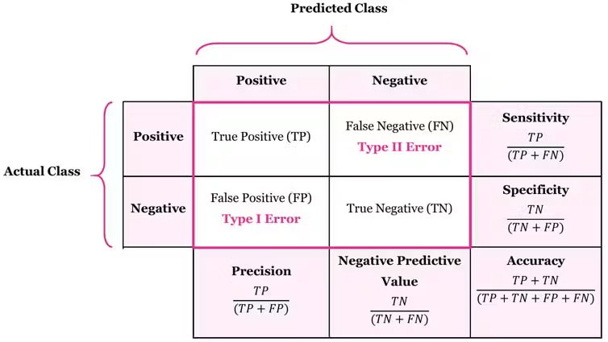
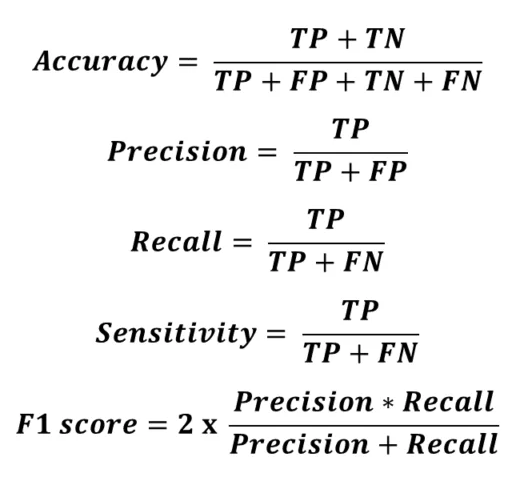
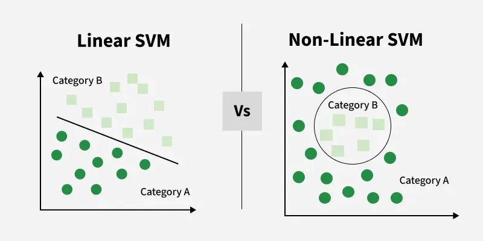
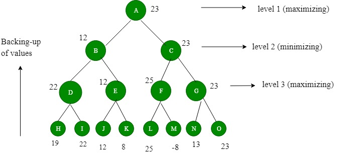
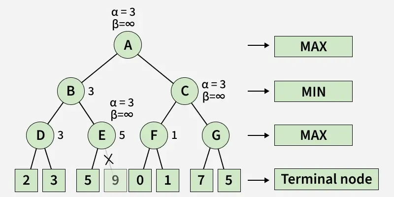
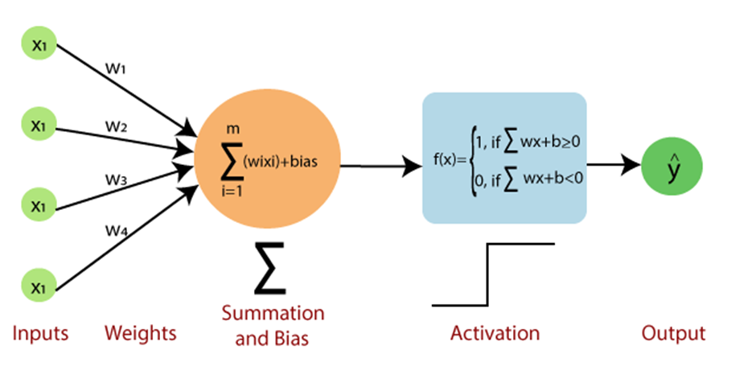
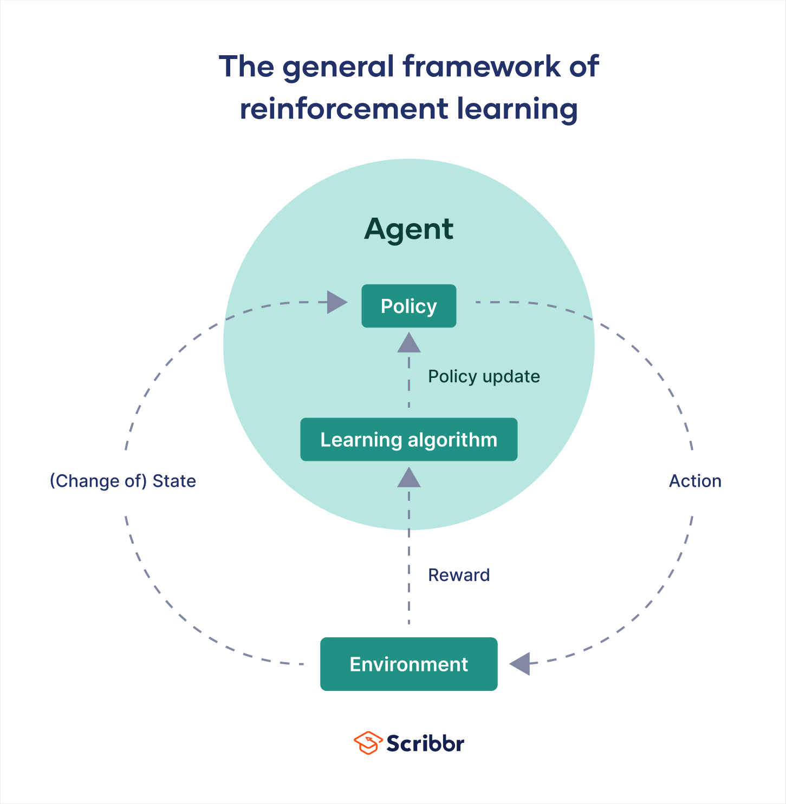

# Final Term Examination

## Topic List

1. **Lecture 1**
    - [**Uncertainty**](#uncertainty) ✅
    - [**Causes of Uncertainty**](#causes-of-uncertainty) ✅
    - [**Rational Decisions**](#11-how-rational-decisions-are-made-using-decision-theory) ✅
    - [**Decision Tree**](#decision-tree) ✅
    - [**Principle of MEU**](#principle-of-meu) ✅
    - [**Probability**](#13-why-probability-is-needed) ✅
    - [**Types of Probability**](#14-types-of-probability) ✅
    - [**Random Variable**](#random-variable) ✅
    - [**Probabilty Model**](#15-probabilty-model) ✅
    - [**Joint Probability Distribution**](#joint-probability-distribution) ✅
    - [**Conditional Probability**](#conditional-probability) ✅
    - [**Inference by Enumeration**](#inference-by-enumeration) ✅
    - [**Normalization**](#normalization) ✅
    - [**Conditional Independence**](#conditional-independence) ✅
    - [**Bayes' Rule**](#bayes-rule) ✅
    - Combining Evidence ⛔

2. **Lecture 2**
    - [**Bayesian Network**](#21-bayesian-network) ✅
    - [**Naive Bayes**](#22-naive-bayes) ✅
    - [**Naive Bayes Models**](#23-naive-bayes-models) ✅
    - [**Bayes Classification**](#bayes-classification) ✅
    - [**Classification vs Regression**](#24-classification-vs-regression) ✅
    - [**NBC Advantages and Disadvantages**](#25-advantages-and-disadvantages-of-naive-bayes-classifier) ✅
    - [**NBC Training Dataset**](#26-training-dataset-of-naive-bayes-classifiers) ✅

3. **Lecture 3**
    - [**Genetic Algorithm**](#31-genetic-algorithm) ✅
    - [**GA Keywords and Terminology**](#keywords-and-terminology) ✅
    - [**GA Flowchart**](#flowchart) ✅
    - [**Traveling Salesman Problem (TSP)**](#32-traveling-salesman-problem-tsp) ✅
    - [**0/1 Knapsack Problem**](#33-01-knapsack-problem) ✅

4. **Lecture 4**
    - [**Confusion Matrix**](#41-confusion-matrix) ✅
    - [**Types of Confusion**](#types-of-confusion) ✅
    - [**Performance Metrics**](#42-performance-metrics)
    - [**Support Vector Machines (SVM)**](#43-support-vector-machines-svm) ✅
    - [**(Linear) Regression Models**](#44-linear-regression-models) ✅

5. **Lecture 5**
    - [**Game Theory**](#51-game-playing-with-ai) ✅
    - [**Mini-Max Algorithm**](#52-mini-max-algorithm) ✅
    - [**Alpha-Beta Pruning**](#53-alpha-beta-pruning) ✅

6. **Lecture 6**
    - [**Single Layer Perceptron**](#61-single-layer-perceptron) ✅
    - [**Artificial vs Biological Neuron**](#62-ann-vs-bnn) ✅
    - [**Reinforcement Learning**](#63-reinforcement-learning) ✅

## Definitions

### Uncertainty

**Uncertainty** is the lack of complete, precise, or crystal-clear information when a system tries to make a prediction or decision.

- **Aleatoric Uncertainty:** Randomness that is built into the real world (like _rolling dice_ or _sudden weather changes_).

- **Epistemic Uncertainty:** A lack of knowledge or gaps in the training data that **can be fixed** by giving the AI more information.

[**↪ Topic List**](#topic-list)

### Causes of Uncertainty

- **Incomplete Data:** Missing sensor readings or hidden variables.
- **Noisy Inputs:** Blurry images or static in audio.
- **Dynamic Environments:** Surroundings that shift unpredictably over time.

[**↪ Topic List**](#topic-list)

### Decision Tree

A **decision tree** is a flowchart-like model that uses a hierarchy of questions and conditions to sort data, solve problems, or make predictions. It mimics human reasoning by breaking a complex choice into simple, step-by-step paths.

- <ins><b>Root node:</b></ins> The top starting point that looks at the whole dataset.
- <ins><b>Internal/Decision nodes:</b></ins> Points where the data is split based on a specific question or test.
- <ins><b>Branches:</b></ins> The lines that connect nodes, showing the outcome of a test or choice.
- <ins><b>Leaf/End nodes:</b></ins> The final predictions or categories at the end of the branches.

[**↪ 1.2. Rational Decision-Making Process**](#12-rational-decision-making-process)

### Principle of MEU

The Principle of MEU (**Maximum Expected Utility**) states that,

> "a rational agent should always choose the action that yields **the highest expected utility**, calculated by weighting the utility of **each possible outcome** by its probability."

[**↪ Topic List**](#topic-list)

### Random Variable

A **random variable** is a mathematical rule that assigns a specific numerical value to each possible outcome of a random event.

- A random variable has a domain of possible values,
- Each value has an assigned probability between 0 and 1,
- The values are mutually exclusive and complete

**Mutually Exclusive?** Disjoint. Only one of them are true.<br>
**Complete?** There is always one that is true.

A random variable: _Weather_

```
P(Weather=Sunny)  = 0.7
P(Weather=Rainy)  = 0.2
P(Weather=Cloudy) = 0.08
P(Weather=Snowy)  = 0.02
```

**The domain?**

```
<Sunny, Rainy, Cloudly, Snowy>
```

**Probability Distribution?**

```
P(Weather) = [0.7 0.2 0.08 0.02]
```

[**↪ Topic List**](#topic-list)

### Joint Probability Distribution

A **joint probability distribution** gives the chance that two or more random variables happen at the same time. Written as `P(X = x, Y = y)`, it shows how variables link together.

**Concepts:**

- **Discrete Variables:** Uses a joint **probability mass function (PMF)** where all values add up to 1.
- **Continuous Variables:** Uses a joint **probability density function (PDF)** where total volume under the surface equals 1.
- **Independence:** Two variables are independent if their joint value equals the product of their individual parts: `P(X, Y) = P(X) • P(Y)`.

[**↪ Topic List**](#topic-list)

### Conditional Probability

**Conditional probability** is the likelihood of an event happening based on the occurrence of a previous or known event.

- Written as `P(A|B)`, which means _the probability of event A given event B_.
- The vertical bar (&#124;) is read as "given".
- It means we look at a reduced sample space where **event B** has already happened.

<p align="center"><br><i><u>figure 0.1.: Formula of Conditional Probability.</u></i></p>

The **chain rule** (or **general product rule**) lets us find the joint probability of multiple events by multiplying individual conditional probabilities:

For **two events A and B**, the rule is:

<p align="center"></p>

[**↪ Topic List**](#topic-list)

### Inference by Enumeration

**Inference by enumeration** is a baseline exact algorithm used to compute the **posterior probability** of a query variable in a Bayesian network by summing terms from the full joint distribution.

[**↪ Topic List**](#topic-list)

### Normalization

**Normalization** is a data-preprocessing technique that scales numerical input features to a common range, most commonly between **0** and **1**.

[**↪ Topic List**](#topic-list)

### Conditional Independence

**Conditional independence** means two random variables are independent of each other once the value of a third variable is known.

In probability theory, two events **A** and **B** are conditionally independent given a third **event C** if the conditional probability of **A** and **B** occurring together given **C** equals the product of their individual conditional probabilities:

<p align="center"><br><i><u>figure 0.3.: Conditional Independence.</u></i></p>

This means that once we know **C** has happened, learning extra information about **A** gives us no new details about **B**, and vice versa.

[**↪ Topic List**](#topic-list)

### Bayes' Rule

**Bayes' Rule** is a mathematical formula that lets us update the probability of an event when we get new evidence or information.

<p align="center"><br><i><u>figure 0.4.: Bayes' Rule.</u></i></p>

### Bayes Classification

**Bayes Classification** is a Supervised machine learning approach for classification. It works on a probabilistic method based on **Bayes Theorem**.

---

## Theoretical Questions

### 1.1. How Rational Decisions are made using Decision Theory?

Rational decisions are made using decision theory by,

- systematically identifying options,
- weighing probabilities and risks, and
- selecting the choice that maximizes personal value or expected utility.

```
Decision Theory = Probability Theory + Utility Theory
```

[**↪ Topic List**](#topic-list)

---

### 1.2. Rational Decision-Making Process

- **Define the problem:** Clearly state the goal or issue that requires a choice.
- **Identify criteria:** Determine which factors matter most (such as cost, time, or risk).
- **Weigh the criteria:** Assign relative importance or numerical values to each factor.
- **Generate alternatives:** List all possible courses of action.
- **Evaluate outcomes:** Use tools like a [**↪ Decision Tree**](#decision-tree) to map out options, potential consequences, and their likelihoods.
- **Maximize utility:** Select the alternative with the highest calculated payoff or satisfaction score.

[**↪ Topic List**](#topic-list)

---

### 1.3. Why Probability is needed?

Probability is a mathematical tool that measures the likelihood of an event or outcome so systems can reason and make decisions despite missing or noisy data.

Notation for unconditional probability for a proposition **A**:

```
P(A)
```

Axioms for probabilities:

```
[1]. 0 <= P(A) <= 1
[2]. P(True) = 1, P(False) = 0
[3]. P(A ∨ B) = P(A) + P(B) - P(A ^ B)
```

Probability is needed to-

- <ins><b>Handle uncertainty:</b></ins> Real-world data is often incomplete or unclear. Probability lets AI score multiple options rather than guessing a single hard answer.
- <ins><b>Make predictions:</b></ins> Models use past patterns to forecast future results, such as the _next word in a sentence_ or _weather trends_.
- <ins><b>Update beliefs:</b></ins> Using **Bayes' Theorem**, AI adjusts its conclusions as new evidence arrives.

[**↪ Topic List**](#topic-list)

---

### 1.4. Types of Probability

**Prior Probability:** The initial chance of an event happening before seeing any new evidence or data. For example, the general chance that an email is spam before reading its contents.

```
Prior = Before any evidence is obtained
```

Properties:

- ✅ Independent
- ✅ Unconditional

**Posterior Probability:** The updated chance of an event happening after new evidence or data is observed. For example, the chance an email is spam after seeing the word "winner" inside it.

```
Posterior = After the evidence is obtained
```

Properties:

- ⛔ Dependent
- ⛔ Conditional

[**↪ Topic List**](#topic-list)

---

### 1.5. Probabilty Model

A **probability model** is a mathematical description of a random situation that lists all possible outcomes and assigns a probability to each one.

**Sample Space (Ω):** The complete set of all possible results or outcomes (like _getting heads or tails when flipping a coin_).

**Events (ω):** Specific outcomes or combinations of outcomes you want to study. Also known as an _atomic event_.

```
ω ∈ Ω
```

**Probabilities:** Numbers from 0 to 1 assigned to each outcome, showing how likely they are to happen. The sum of all probabilities in the model must always equal 1.

```
[1]. 0 <= P(ω) <= 1
[2]. ∑(ω) P(ω) = 1
```

[**↪ Topic List**](#topic-list)

---

### 2.1. Bayesian Network

A **Bayesian network** is a probabilistic graphical model that represents a set of variables and their conditional dependencies using a **directed acyclic graph (DAG)**. The graphs have no loops, meaning we can never follow the arrows back to our starting point, which prevents infinite feedback loops.

[**↪ Topic List**](#topic-list)

---

### 2.2. Naive Bayes

**Naive Bayes** is a fast, simple machine learning classification algorithm based on **probability** and **Bayes' Theorem**.

It is called _naive_ because it assumes all features in a dataset are completely independent of one another, an idea that is rarely true in real life but makes the math very easy and efficient.

**Use cases:**

1. Spam filtering
2. Sentiment analysis
3. Document categorization

[**↪ Topic List**](#topic-list)

---

### 2.3. Naive Bayes Models

1. **Gaussian:** Used for continuous data (like height or weight)
2. **Multinomial:** Used for discrete counts
3. **Bernoulli:** Used when features are binary

[**↪ Topic List**](#topic-list)

---

### 2.4. Classification vs Regression

|                      | Classification                       | Regression                                           |
| :------------------- | :----------------------------------- | :--------------------------------------------------- |
| **Output&nbsp;Type** | Class labels                         | Real numbers                                         |
| **Goal**             | Draw a decision boundary             | Fit a best-fit line or curve                         |
| **Evaluation**       | Uses accuracy, precision, and recall | Uses error metrics like **Mean Squared Error (MSE)** |

**Examples:**

| Classification                  | Regression                                       |
| :------------------------------ | :----------------------------------------------- |
| Is an email spam or not?        | What will the exact selling price of a house be? |
| Is a tumor malignant or benign? | What will the temperature be tomorrow?           |
| What animal is in the photo?    | How much rain will fall next week?               |

[**↪ Topic List**](#topic-list)

---

### 2.5. Advantages and Disadvantages of Naive Bayes Classifier

**Advantages**

- **High speed and efficiency**

    It trains and predicts very quickly, making it ideal for real-time applications like spam detection.

- **Handles high-dimensional data**

    It performs remarkably well with large numbers of features, such as words in document classification.

- **Low data requirement**

    It needs relatively little training data to estimate parameters accurately.

- **Simple implementation**

    It has minimal hyperparameters to tune compared to deep learning models.

**Disadvantages**

- **Independence assumption**

    It assumes all features are independent, which rarely matches real-world correlated data.

- **Zero-frequency problem**

    It assigns zero probability to unseen categorical values in test data unless smoothing is applied.

- **Imbalanced data sensitivity**

    It can struggle and lean toward majority classes if the dataset is heavily skewed.

- **Poor probability estimates**

    While it predicts classes well, its calculated probability outputs are not always reliable.

[**↪ Topic List**](#topic-list)

---

### 2.6. Training Dataset of Naive Bayes Classifiers

A training dataset for a Naive Bayes classifier is a collection of **labeled data** containing _input features_ and a _target class label_ used to calculate conditional probabilities.

**Key Structure:**

- **Feature Matrix (_X_):** Contains the input variables or attributes (such as word counts, weather conditions, or measurements) that describe each data point.
- **Response Vector (_y_):** Contains the known category or class label (such as "spam" or "ham", "yes" or "no") for each row in the feature matrix.

[**↪ Topic List**](#topic-list)

---

### 3.1. Genetic Algorithm

A **genetic algorithm (GA)** is an artificial intelligence search and optimization technique based on **natural selection** and **genetics**. It is a type of evolutionary computation inspired by _Darwin's theory of evolution_.

It evolves a pool of candidate solutions over multiple generations using selection, crossover, and mutation to solve complex problems where traditional math methods fail.

#### Working Principle

- **Population:** A set of multiple candidate solutions (called chromosomes).
- **Fitness Function:** A score that shows how well a specific solution solves the goal.
- **Selection:** Picking the best-scoring solutions to act as parents.
- **Crossover:** Combining parts of two parents to make new child solutions.
- **Mutation:** Changing random parts of a child solution to keep variety in the pool.
- **Repeat:** The cycle runs until it finds a good solution or hits a set limit.

[**↪ Topic List**](#topic-list)

#### Keywords and Terminology

- <ins><b>Evolution:</b></ins> A series of genetic changes by which a living organism acquires characteristics that distinguish it from other organisms.

- <ins><b>Gene:</b></ins> A basic unit of chromosome that controls the development of a particular feature of a living organism. A gene is represented by either 0 or 1.

- <ins><b>Chromosomes:</b></ins> A string of genes that represent an individual. Each chromosome consists of a number of gene.

- <ins><b>Fitness:</b></ins> The ability of a living organism to survive and reproduce in a specific environment.

- <ins><b>Crossover:</b></ins> A reproduction operator that creates a new chromosome by exchanging parts of two existing chromosome.

- <ins><b>Mutation:</b></ins> A genetic operator that randomly change the gene value in a chromosome.

- <ins><b>Fitness Function:</b></ins> A mathematical function used for calculating the fitness of a chromosome.

- <ins><b>Crossover Probability:</b></ins> A number between zero and one that indicates the probability of two chromosomes crossing over.

- <ins><b>Mutation Probability:</b></ins> A number between zero and one that indicates the probability of mutation occurring in a single gene.

- <ins><b>Offspring:</b></ins> An individual that was produced through reproduction. It also referred to as child.

- <ins><b>Population:</b></ins> A group of individuals that breed together.

[**↪ Topic List**](#topic-list)

#### Flowchart

<p align="center"><br><i><u>figure 3.1.: Flowchart of Genetic Algorithm.</u></i></p>

[**↪ Topic List**](#topic-list)

---

### 3.2. Traveling Salesman Problem (TSP)

Genetic Algorithm solves **TSP** by mimicking natural selection to find a near-optimal, shortest route through a set of cities.

- Because TSP is an **NP-hard optimization problem**, checking every single combination becomes computationally impossible as the number of cities grows.

- Genetic Algorithm offers an efficient workaround by evolving a population of guess routes over multiple generations until they converge on an efficient path.

#### Components

The components of the Traveling Salesman Problem mapped directly to biological concepts:

- **Gene:** A single city (e.g., _City A_, _City B_).

- **Chromosome (Individual):** A complete valid route that visits every city exactly once and returns to the start (e.g., _(A -> C -> B -> D)_).

- **Population:** A collection of multiple alternative routes.

- **Fitness Score:** The inverse of the total route distance. **Shorter paths mean higher fitness.**

#### Workflow

1. <ins><b>Initialization</b></ins>

    The algorithm generates an initial population of `P` chromosomes. These are typically created by randomly shuffling the list of cities for each individual to ensure a highly diverse starting gene pool.

2. <ins><b>Fitness Evaluation</b></ins>

    The total travel distance is calculated for each route. The fitness formula ensures that shorter paths are prioritized:

    ```
    Fitness = 1 / Distance
    ```

3. <ins><b>Selection</b></ins>

    The algorithm selects the best-performing parent routes to pass their traits to the next generation. Common selection methods include:
    - **Roulette Wheel Selection:** Parent routes are chosen randomly, but their probability of selection is proportional to their fitness score.
    - **Tournament Selection:** A small random subset of paths is picked, and the single shortest route among them wins the right to mate.
    - **Elitism:** A designated percentage of the absolute shortest routes are copied directly into the next generation without modification to preserve top-tier solutions.

4. <ins><b>Crossover (Recombination)</b></ins>

    Two selected parent routes combine to form a new child route. **Standard crossovers do not work for TSP** because they can easily produce illegal routes that skip cities or visit the same city twice. Specialized operators must be used instead.

5. <ins><b>Mutation</b></ins>

    To prevent the algorithm from getting stuck in localized bad habits (local optima), minor random variations are injected into the offspring.
    - **Swap Mutation:** Two randomly selected cities in a single path swap their positions.
    - **Inversion Mutation:** A random subset sequence of the route is cut out, completely reversed, and spliced back into the path.

6. <ins><b>Termination</b></ins>

    **Steps 2 through 5 repeat** for a set number of generations (`n`), or until the total route distance stops improving over a fixed period of time.

[**↪ Topic List**](#topic-list)

---

### 3.3. 0/1 Knapsack Problem

A genetic algorithm solves the 0/1 Knapsack Problem by **evolving a population of binary bit strings** where each bit represents including (1) or excluding (0) a specific item; to maximize total value without exceeding weight limits.

#### Workflow

1. <ins><b>Representation:</b></ins> Encode solutions as a binary array (chromosome) of length n (total items), where 1 means the item is picked and 0 means it is left behind.

2. <ins><b>Population Initialization:</b></ins> Generate a random starting group of potential bit-string solutions.

3. <ins><b>Fitness Evaluation:</b></ins> Sum the total value of chosen items. If total weight exceeds the maximum capacity, assign a fitness score of zero (or apply a heavy penalty).

4. <ins><b>Selection:</b></ins> Choose healthier parent solutions using methods like tournament selection or roulette-wheel selection so better solutions reproduce more often.

5. <ins><b>Crossover:</b></ins> Swap parts of parent chromosomes (such as single-point crossover) to produce child solutions.

6. <ins><b>Mutation:</b></ins> Randomly flip bits with a very low probability to maintain genetic diversity and avoid getting stuck in local optima.

[**↪ Topic List**](#topic-list)

---

### 4.1. Confusion Matrix

A confusion matrix is a simple table used to evaluate the performance of a classification model.

#### Types of Confusion

- **True Positive (TP):** The model says yes, and the true answer is yes.
- **True Negative (TN):** The model says no, and the true answer is no.
- **False Positive (FP):** The model says yes, but the true answer is no **(Type 1 error)**.
- **False Negative (FN):** The model says no, but the true answer is yes **(Type 2 error)**.

<p align="center"><br><i><u>figure 4.1.: Confusion Matrix.</u></i></p>

[**↪ Topic List**](#topic-list)

---

### 4.2. Performance Metrics

<p align="center"><br><i><u>figure 4.2.: Performance Metrics Calculation using Confusion Matrix.</u></i></p>

[**↪ Topic List**](#topic-list)

---

### 4.3. Support Vector Machines (SVM)

A **Support Vector Machine (SVM)** is a popular supervised ML algorithm used to sort data into different groups or categories.

- **Linear SVM:** Used when data can be neatly split by a straight line or flat plane.

- **Non-Linear SVM:** Used when data is mixed up and cannot be split by a straight line. It uses a tool called a kernel to lift data into a higher dimension where a clean line can divide it.

<p align="center"><br><i><u>figure 4.3.: SVM Types.</u></i></p>

[**↪ Topic List**](#topic-list)

---

### 4.4. Linear Regression Models

1. **Simple Linear Regression:** Uses a single input variable to fit a straight line predicting a continuous output.

2. **Multiple Linear Regression:** Uses two or more input variables to predict a single continuous output.

3. **Polynomial Regression:** Fits a curved or non-linear line by adding powers of the input variables.

[**↪ Topic List**](#topic-list)

---

### 5.1. Game Playing with AI

Game playing is non-trivial.

1. Needs "human-like" intelligence,
2. Can be very complex,
3. Needs decision making within limited time.

Games are,

1. Well-defined and repeatable,
2. Limited and accessible.

There are two types of Game Playing Algorithm,

1. **Mini-max Algorithm**,
2. **Alpha-Beta Pruning**.

[**↪ Topic List**](#topic-list)

---

### 5.2. Mini-Max Algorithm

The Minimax algorithm is a backtracking, decision-making algorithm used in game theory and artificial intelligence to find the optimal move for a player in a two-player, turn-based, zero-sum game.

It operates on the fundamental assumption that both players will play perfectly (optimally) throughout the match.

<p align="center"><br><i><u>figure 5.2.: Game Tree.</u></i></p>

#### Terminology

- **Maximizer (MAX):** The player attempting to get the highest score possible.
- **Minimizer (MIN):** The opponent attempting to minimize the maximizer's score (giving the maximizer the lowest possible score).
- **Game Tree:** A tree graph representation of all potential moves, where nodes represent game states and edges represent moves.
- **Terminal States:** The final leaf nodes representing game over (win, loss, or draw).
- **Utility / Heuristic Value:** A score assigned to terminal states (e.g., +1 for a win, -1 for a loss, 0 for a draw).

#### Workflow

The algorithm explores paths recursively using a Depth-First Search (DFS) strategy:

```
      [ MAX ]          Level 0 (Root Node - Your Turn)
     /       \
 [ MIN ]   [ MIN ]     Level 1 (Opponent's Turn)
 /    \     /    \
3      5   2      9    Level 2 (Terminal Leaf Nodes)
```

1. **Tree Generation**

    The AI generates the game tree from the current state down to the terminal nodes.

2. **Leaf Evaluation**

    The utility function calculates static scores for all end-game leaf nodes.

3. **Backpropagation**

    The scores are passed upward through the tree, level by level:
    - At a MIN level, the parent node inherits the minimum score among its children.
    - At a MAX level, the parent node inherits the maximum score among its children.

4. **Move Choice**

    Upon reaching the root node, MAX safely selects the move leading to the absolute highest guaranteed value.

[**↪ Topic List**](#topic-list)

---

### 5.3. Alpha-Beta Pruning

**Alpha-beta pruning** is a search optimization algorithm for the minimax algorithm.

It reduces the number of nodes evaluated in a game tree by cutting off branches that cannot influence the final decision, maintaining the same optimal result while significantly speeding up computation.

<p align="center"><br><i><u>figure 5.3.: Alpha-Beta pruning.</u></i></p>

- **Alpha (α):** The highest score the maximizing player can guarantee so far. Initialized to **negative infinity (-∞)**.
- **Beta (β):** The lowest score the minimizing player can guarantee so far. Initialized to **positive infinity (+∞)**.

#### Workflow

- **Condition:** Stop evaluation and prune the remaining branches of a node if _α ≥ β_.
- **Reasoning:** If a player already has a better or equal option elsewhere, the opponent will force play away from the current branch, making further exploration useless.

[**↪ Topic List**](#topic-list)

---

### 6.1. Single Layer Perceptron

A **single layer perceptron** is the most basic type of artificial neural network. It has an input layer that passes data directly to an output layer without any hidden layers.

<p align="center"><br><i><u>figure 6.1.: Single Layer Perceptron.</u></i></p>

#### Working Principle

- **Inputs:** Raw data features (_x1_, _x2_) enter the network.
- **Weights:** Each input gets multiplied by a weight (_w1_, _w2_, ...) to show its importance.
- **Bias:** A constant value added to shift the decision boundary.
- **Summation:** Calculates the weighted sum:

    ```
    z = ∑(xi • wi) + b
    ```

- **Activation:** A step or threshold function turns the sum into a binary output, usually 0 or 1.

#### Training and Learning

- Starts with random weights and a random bias.
- Processes training inputs to predict an output.
- Compares the prediction to the real target value to find the error.
- Updates weights using the perceptron learning rule until errors stop.

#### Pros and Cons

- **Fast and simple:** Requires little compute power and trains very quickly.
- **Linear separation:** Works well for simple logic gates like **AND** and **OR**.
- **Cannot solve non-linear tasks:** Fails on complex patterns like the **XOR** problem because it can only draw a straight line.

[**↪ Topic List**](#topic-list)

---

### 6.2. ANN vs BNN

> "Biological and artificial neurons differ fundamentally in their physical structure, signal transmission methods, and energy efficiency, despite artificial models being loosely inspired by the brain."

1. **Structure and Components**
    - **Biological Neuron:** Made of a cell body (soma), branching dendrites that receive signals, and a single long axon that sends them out.
    - **Artificial Neuron:** Made of mathematical inputs, static or dynamic numeric weights, a bias term, and an activation function.

2. **Signal and Communication**
    - **Biological Neuron:** Uses electrochemical impulses, action potentials, and chemical neurotransmitters across synapses.
    - **Artificial Neuron:** Passes simple numerical floating-point values forward through weighted multiplication and layers.

3. **Learning and Adaptability**
    - **Biological Neuron:** Continuously adapts via synaptic plasticity, growing or pruning connections dynamically based on lived experience.
    - **Artificial Neuron:** Learns in structured training phases using algorithms like backpropagation and gradient descent to modify weights.

4. **Energy and Efficiency**
    - **Biological Neuron:** Operates within a massively parallel network using only about _20 watts\*_ of power.
    - **Artificial Neuron:** Demands high-powered computing hardware or GPUs, consuming significantly more energy during training and inference.

[**↪ Topic List**](#topic-list)

---

### 6.3. Reinforcement Learning

A branch of ML where an autonomous agent learns to make decisions by performing actions and interacting with an environment to maximize cumulative rewards.

#### Core Components

- **Agent:** The learner or decision-maker.
- **Environment:** The external world or system the agent interacts with.
- **State:** The current condition or situation of the agent.
- **Action:** The moves or decisions the agent can choose from.
- **Reward:** The positive or negative feedback signal given by the environment after an action.

#### Working Principle

- The agent observes the current state of the environment.
- It selects an action based on its strategy, called a policy.
- The environment shifts to a new state and returns a reward or penalty.
- The agent updates its knowledge to favor good choices in the future.
- It constantly balances exploration (trying new moves) with exploitation (using known good moves).

<p align="center"><br><i><u>figure 6.3.: The general framework of reinforcement learning.</u></i></p>

[**↪ Topic List**](#topic-list)
