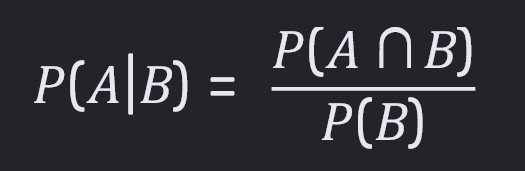
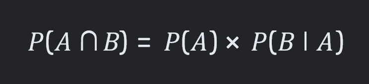
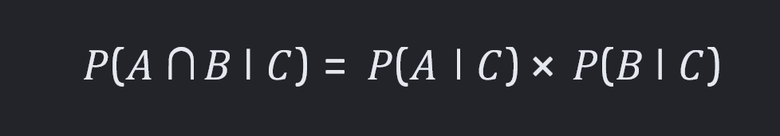
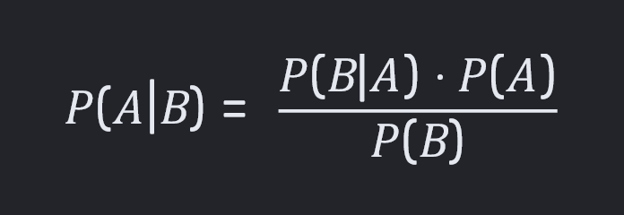

# Final Term Examination

## Topic List

1. **Lecture 1**
    - [**Uncertainty**](#uncertainty) ✅
    - [**Causes of Uncertainty**](#causes-of-uncertainty) ✅
    - [**Rational Decisions**](#11-how-rational-decisions-are-made-using-decision-theory) ✅
    - [**Decision Tree**](#decision-tree) ✅
    - [**Principle of MEU**](#principle-of-meu) ✅
    - [**Probability**](#13-why-probability-is-needed) ✅
    - [**Types of Probability**](#14-types-of-probability) ✅
    - [**Random Variable**](#random-variable) ✅
    - [**Probabilty Model**](#15-probabilty-model) ✅
    - [**Joint Probability Distribution**](#joint-probability-distribution) ✅
    - [**Conditional Probability**](#conditional-probability) ✅
    - [**Inference by Enumeration**](#inference-by-enumeration) ✅
    - [**Normalization**](#normalization) ✅
    - [**Conditional Independence**](#conditional-independence) ✅
    - [**Bayes' Rule**](#bayes-rule) ✅
    - Combining Evidence ⛔

2. **Lecture 2**
    - [**Bayesian Network**](#21-bayesian-network) ✅
    - [**Naive Bayes**](#22-naive-bayes) ✅
    - [**Naive Bayes Models**](#23-naive-bayes-models) ✅
    - [**Bayes Classification**](#bayes-classification) ✅
    - [**Classification vs Regression**](#24-classification-vs-regression) ✅
    - [**NBC Advantages and Disadvantages**](#25-advantages-and-disadvantages-of-naive-bayes-classifier) ✅
    - [**NBC Training Dataset**](#26-training-dataset-of-naive-bayes-classifiers) ✅

3. **Lecture 3**
    - Genetic Algorithm
    - GA Keywords and Terminology
    - GA Flowchart
    - Traveling Salesman Problem (TSP)
    - 0/1 Knapsack Problem

4. **Lecture 4**
    - Confusion Matrix
    - Types of Confusion
    - Support Vector Machines (SVM)
    - Regression Types

5. **Lecture 5**
    - Game Theory
    - Mini-Max
    - Alpha-Beta Pruning

6. **Lecture 6**
    - Single Layer Perceptron
    - Terminology
    - Artificial vs Biological Neuron
    - Reinforcement Learning

## Definitions

### Uncertainty

**Uncertainty** is the lack of complete, precise, or crystal-clear information when a system tries to make a prediction or decision.

- **Aleatoric Uncertainty:** Randomness that is built into the real world (like _rolling dice_ or _sudden weather changes_).

- **Epistemic Uncertainty:** A lack of knowledge or gaps in the training data that **can be fixed** by giving the AI more information.

[**↪ Topic List**](#topic-list)

### Causes of Uncertainty

- **Incomplete Data:** Missing sensor readings or hidden variables.
- **Noisy Inputs:** Blurry images or static in audio.
- **Dynamic Environments:** Surroundings that shift unpredictably over time.

[**↪ Topic List**](#topic-list)

### Decision Tree

A **decision tree** is a flowchart-like model that uses a hierarchy of questions and conditions to sort data, solve problems, or make predictions. It mimics human reasoning by breaking a complex choice into simple, step-by-step paths.

- <ins><b>Root node:</b></ins> The top starting point that looks at the whole dataset.
- <ins><b>Internal/Decision nodes:</b></ins> Points where the data is split based on a specific question or test.
- <ins><b>Branches:</b></ins> The lines that connect nodes, showing the outcome of a test or choice.
- <ins><b>Leaf/End nodes:</b></ins> The final predictions or categories at the end of the branches.

[**↪ 1.2. Rational Decision-Making Process**](#12-rational-decision-making-process)

### Principle of MEU

The Principle of MEU (**Maximum Expected Utility**) states that,

> "a rational agent should always choose the action that yields **the highest expected utility**, calculated by weighting the utility of **each possible outcome** by its probability."

[**↪ Topic List**](#topic-list)

### Random Variable

A **random variable** is a mathematical rule that assigns a specific numerical value to each possible outcome of a random event.

- A random variable has a domain of possible values,
- Each value has an assigned probability between 0 and 1,
- The values are mutually exclusive and complete

**Mutually Exclusive?** Disjoint. Only one of them are true.<br>
**Complete?** There is always one that is true.

A random variable: _Weather_

```
P(Weather=Sunny)  = 0.7
P(Weather=Rainy)  = 0.2
P(Weather=Cloudy) = 0.08
P(Weather=Snowy)  = 0.02
```

**The domain?**

```
<Sunny, Rainy, Cloudly, Snowy>
```

**Probability Distribution?**

```
P(Weather) = [0.7 0.2 0.08 0.02]
```

[**↪ Topic List**](#topic-list)

### Joint Probability Distribution

A **joint probability distribution** gives the chance that two or more random variables happen at the same time. Written as `P(X = x, Y = y)`, it shows how variables link together.

**Concepts:**

- **Discrete Variables:** Uses a joint **probability mass function (PMF)** where all values add up to 1.
- **Continuous Variables:** Uses a joint **probability density function (PDF)** where total volume under the surface equals 1.
- **Independence:** Two variables are independent if their joint value equals the product of their individual parts: `P(X, Y) = P(X) • P(Y)`.

[**↪ Topic List**](#topic-list)

### Conditional Probability

**Conditional probability** is the likelihood of an event happening based on the occurrence of a previous or known event.

- Written as `P(A|B)`, which means _the probability of event A given event B_.
- The vertical bar (&#124;) is read as "given".
- It means we look at a reduced sample space where **event B** has already happened.

<p align="center"><br><i><u>figure 0.1.: Formula of Conditional Probability.</u></i></p>

The **chain rule** (or **general product rule**) lets us find the joint probability of multiple events by multiplying individual conditional probabilities:

For **two events A and B**, the rule is:

<p align="center"></p>

[**↪ Topic List**](#topic-list)

### Inference by Enumeration

**Inference by enumeration** is a baseline exact algorithm used to compute the **posterior probability** of a query variable in a Bayesian network by summing terms from the full joint distribution.

[**↪ Topic List**](#topic-list)

### Normalization

**Normalization** is a data-preprocessing technique that scales numerical input features to a common range, most commonly between **0** and **1**.

[**↪ Topic List**](#topic-list)

### Conditional Independence

**Conditional independence** means two random variables are independent of each other once the value of a third variable is known.

In probability theory, two events **A** and **B** are conditionally independent given a third **event C** if the conditional probability of **A** and **B** occurring together given **C** equals the product of their individual conditional probabilities:

<p align="center"><br><i><u>figure 0.3.: Conditional Independence.</u></i></p>

This means that once we know **C** has happened, learning extra information about **A** gives us no new details about **B**, and vice versa.

[**↪ Topic List**](#topic-list)

### Bayes' Rule

**Bayes' Rule** is a mathematical formula that lets us update the probability of an event when we get new evidence or information.

<p align="center"><br><i><u>figure 0.4.: Bayes' Rule.</u></i></p>

### Bayes Classification

**Bayes Classification** is a Supervised machine learning approach for classification. It works on a probabilistic method based on **Bayes Theorem**.

---

## Theoretical Questions

### 1.1. How Rational Decisions are made using Decision Theory?

Rational decisions are made using decision theory by,

- systematically identifying options,
- weighing probabilities and risks, and
- selecting the choice that maximizes personal value or expected utility.

```
Decision Theory = Probability Theory + Utility Theory
```

[**↪ Topic List**](#topic-list)

---

### 1.2. Rational Decision-Making Process

- **Define the problem:** Clearly state the goal or issue that requires a choice.
- **Identify criteria:** Determine which factors matter most (such as cost, time, or risk).
- **Weigh the criteria:** Assign relative importance or numerical values to each factor.
- **Generate alternatives:** List all possible courses of action.
- **Evaluate outcomes:** Use tools like a [**↪ Decision Tree**](#decision-tree) to map out options, potential consequences, and their likelihoods.
- **Maximize utility:** Select the alternative with the highest calculated payoff or satisfaction score.

[**↪ Topic List**](#topic-list)

---

### 1.3. Why Probability is needed?

Probability is a mathematical tool that measures the likelihood of an event or outcome so systems can reason and make decisions despite missing or noisy data.

Notation for unconditional probability for a proposition **A**:

```
P(A)
```

Axioms for probabilities:

```
[1]. 0 <= P(A) <= 1
[2]. P(True) = 1, P(False) = 0
[3]. P(A ∨ B) = P(A) + P(B) - P(A ^ B)
```

Probability is needed to-

- <ins><b>Handle uncertainty:</b></ins> Real-world data is often incomplete or unclear. Probability lets AI score multiple options rather than guessing a single hard answer.
- <ins><b>Make predictions:</b></ins> Models use past patterns to forecast future results, such as the _next word in a sentence_ or _weather trends_.
- <ins><b>Update beliefs:</b></ins> Using **Bayes' Theorem**, AI adjusts its conclusions as new evidence arrives.

[**↪ Topic List**](#topic-list)

---

### 1.4. Types of Probability

**Prior Probability:** The initial chance of an event happening before seeing any new evidence or data. For example, the general chance that an email is spam before reading its contents.

```
Prior = Before any evidence is obtained
```

Properties:

- ✅ Independent
- ✅ Unconditional

**Posterior Probability:** The updated chance of an event happening after new evidence or data is observed. For example, the chance an email is spam after seeing the word "winner" inside it.

```
Posterior = After the evidence is obtained
```

Properties:

- ⛔ Dependent
- ⛔ Conditional

[**↪ Topic List**](#topic-list)

---

### 1.5. Probabilty Model

A **probability model** is a mathematical description of a random situation that lists all possible outcomes and assigns a probability to each one.

**Sample Space (Ω):** The complete set of all possible results or outcomes (like _getting heads or tails when flipping a coin_).

**Events (ω):** Specific outcomes or combinations of outcomes you want to study. Also known as an _atomic event_.

```
ω ∈ Ω
```

**Probabilities:** Numbers from 0 to 1 assigned to each outcome, showing how likely they are to happen. The sum of all probabilities in the model must always equal 1.

```
[1]. 0 <= P(ω) <= 1
[2]. ∑(ω) P(ω) = 1
```

[**↪ Topic List**](#topic-list)

---

### 2.1. Bayesian Network

A **Bayesian network** is a probabilistic graphical model that represents a set of variables and their conditional dependencies using a **directed acyclic graph (DAG)**. The graphs have no loops, meaning we can never follow the arrows back to our starting point, which prevents infinite feedback loops.

[**↪ Topic List**](#topic-list)

---

### 2.2. Naive Bayes

**Naive Bayes** is a fast, simple machine learning classification algorithm based on **probability** and **Bayes' Theorem**.

It is called _naive_ because it assumes all features in a dataset are completely independent of one another, an idea that is rarely true in real life but makes the math very easy and efficient.

**Use cases:**

1. Spam filtering
2. Sentiment analysis
3. Document categorization

[**↪ Topic List**](#topic-list)

---

### 2.3. Naive Bayes Models

1. **Gaussian:** Used for continuous data (like height or weight)
2. **Multinomial:** Used for discrete counts
3. **Bernoulli:** Used when features are binary

[**↪ Topic List**](#topic-list)

---

### 2.4. Classification vs Regression

|                      | Classification                       | Regression                                           |
| :------------------- | :----------------------------------- | :--------------------------------------------------- |
| **Output&nbsp;Type** | Class labels                         | Real numbers                                         |
| **Goal**             | Draw a decision boundary             | Fit a best-fit line or curve                         |
| **Evaluation**       | Uses accuracy, precision, and recall | Uses error metrics like **Mean Squared Error (MSE)** |

**Examples:**

| Classification                  | Regression                                       |
| :------------------------------ | :----------------------------------------------- |
| Is an email spam or not?        | What will the exact selling price of a house be? |
| Is a tumor malignant or benign? | What will the temperature be tomorrow?           |
| What animal is in the photo?    | How much rain will fall next week?               |

[**↪ Topic List**](#topic-list)

---

### 2.5. Advantages and Disadvantages of Naive Bayes Classifier

**Advantages**

- **High speed and efficiency**

    It trains and predicts very quickly, making it ideal for real-time applications like spam detection.

- **Handles high-dimensional data**

    It performs remarkably well with large numbers of features, such as words in document classification.

- **Low data requirement**

    It needs relatively little training data to estimate parameters accurately.

- **Simple implementation**

    It has minimal hyperparameters to tune compared to deep learning models.

**Disadvantages**

- **Independence assumption**

    It assumes all features are independent, which rarely matches real-world correlated data.

- **Zero-frequency problem**

    It assigns zero probability to unseen categorical values in test data unless smoothing is applied.

- **Imbalanced data sensitivity**

    It can struggle and lean toward majority classes if the dataset is heavily skewed.

- **Poor probability estimates**

    While it predicts classes well, its calculated probability outputs are not always reliable.

[**↪ Topic List**](#topic-list)

---

### 2.6. Training Dataset of Naive Bayes Classifiers

A training dataset for a Naive Bayes classifier is a collection of **labeled data** containing _input features_ and a _target class label_ used to calculate conditional probabilities.

**Key Structure:**

- **Feature Matrix (_X_):** Contains the input variables or attributes (such as word counts, weather conditions, or measurements) that describe each data point.
- **Response Vector (_y_):** Contains the known category or class label (such as "spam" or "ham", "yes" or "no") for each row in the feature matrix.

[**↪ Topic List**](#topic-list)

---
