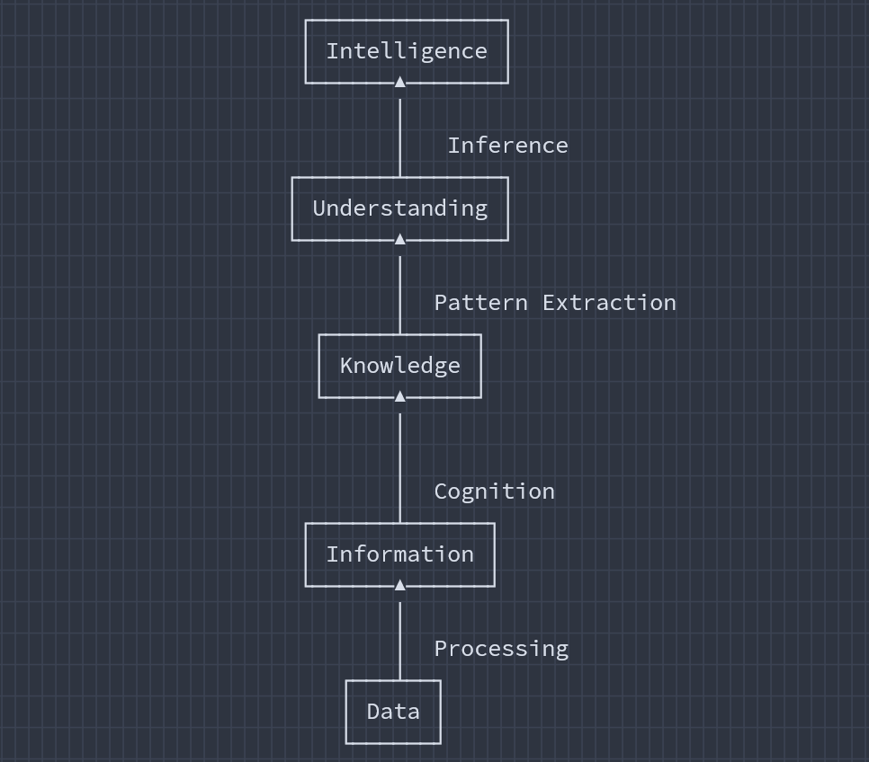
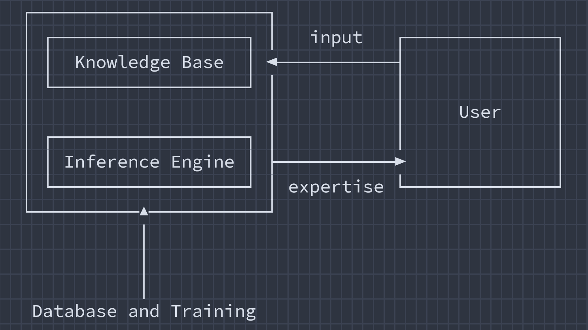
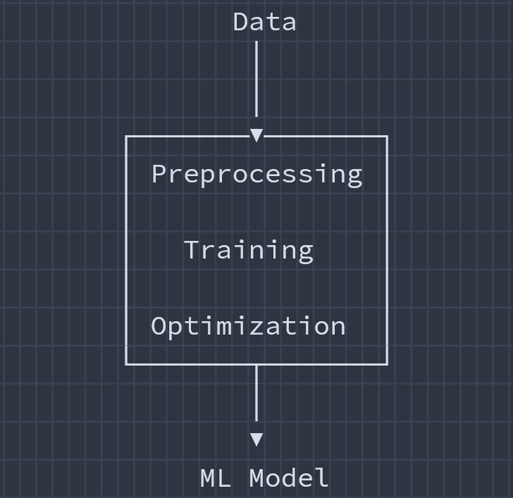
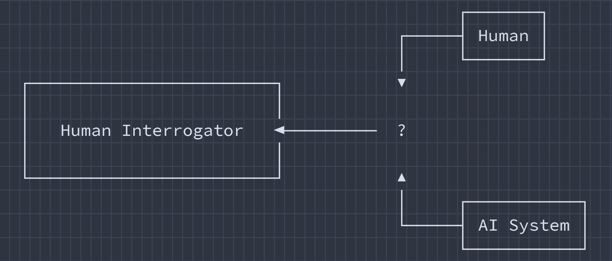
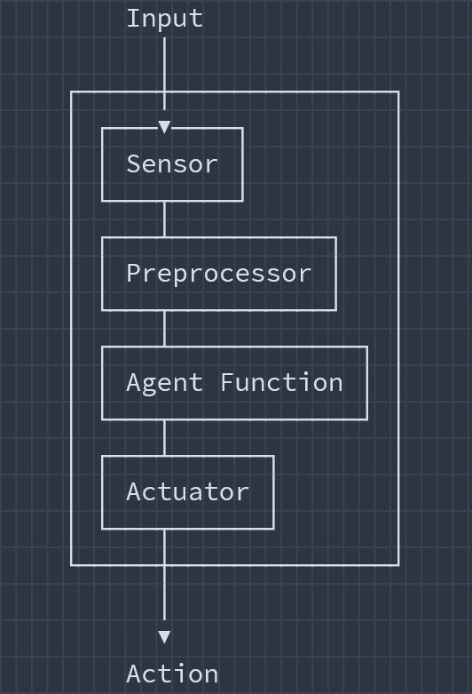
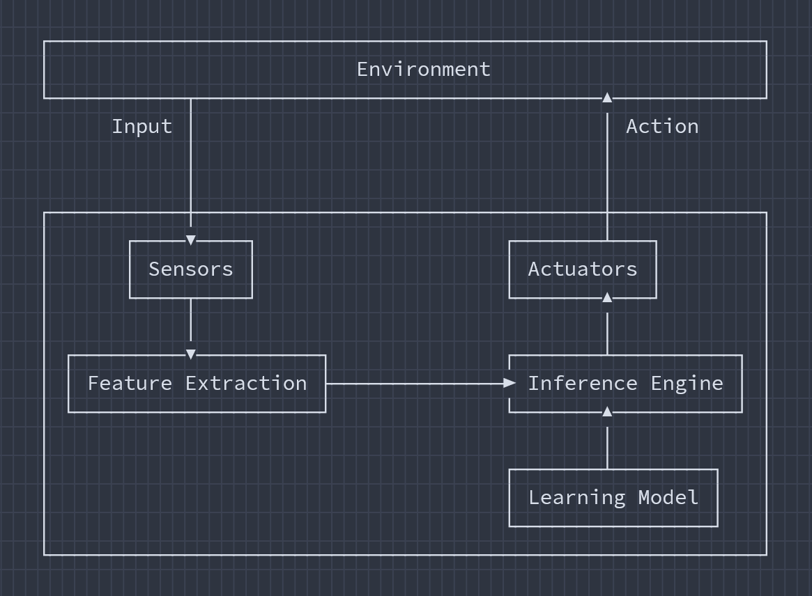
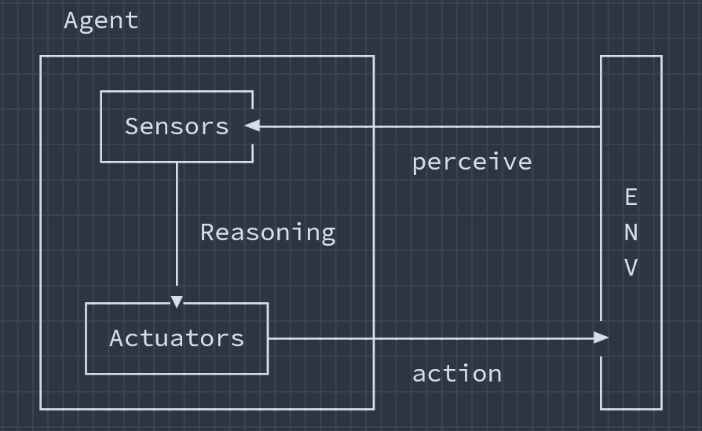

# Mid Term Examination

## Topic List

1. **Lecture 1**
    - [**Artificial Intelligence**](#artificial-intelligence) ✅
    - [**Significance of Studying AI**](#11-why-do-we-need-to-study-ai) ✅
    - [**Applications of AI**](#13-applications-of-ai) ✅
    - [**Relevant Fields of AI**](#16-relevant-fields-of-ai) ✅
    - [**Goals of AI**](#17-goals-of-ai) ✅
        - [**Thinking Humanly**](#17a-thinking-humanly) ✅
        - [**Acting Humanly**](#17b-acting-humanly) ✅
        - [**Thinking Rationally**](#17d-thinking-rationally) ✅
    - [**Turing Test**](#18-turing-test) ✅
    - [**Building an Intelligent Agent**](#19-building-an-intelligent-agent) ✅
    - [**Strong AI vs Weak AI**](#110-strong-ai-vs-weak-ai) ✅
    - [**Alan Turing**](#111-alan-turing) ✅

2. **Lecture 2**
    - [**Knowledge and Data**](#21-knowledge-and-data) ✅
    - [**Inference**](#inference) ✅
    - [**Agent**](#22-agent) ✅
    - [**The PEAS Framework**](#23-the-peas-framework) ✅
    - [**Task Environment**](#24-task-environment) ✅
    - Types of Agent
    - Learning
    - Classification (_Partial_)

3. **Lecture 3**
    - Problem Types
    - State Space
    - 8 Puzzle Game
    - Searching
        - Tree Searching
        - Searching Strategies
        - Evaluating Search Methods
    - Uninformed Searching Methods
        - Breadth-First Search (BFS)
        - Depth-First Search (DFS)
        - BFS vs DFS
        - Depth Limited Search (DLS)
        - Iterative Deepening Search (IDS)
        - Uniform-Cost Search (UCS)
        - Bidirectional Search

4. **Lecture 4**
    - Informed (Heuristic) Searching Methods
        - Simple Hill Climbing
        - A\* Algorithm

## Definitions

### Artificial Intelligence

Artificial intelligence (**AI**) is a branch of computer science focused on building systems capable of performing tasks that typically require human intelligence.

- AI is a way of **making machines think** and **behave intelligently**. These machines are controlled by intelligent softwares.
- AI is a science of **finding theories** and **methodologies**.
- AI helps machines **understand the world** and **react to situations** accordingly.
- AI is closely related to the study of human brain. By mimicking the way the human brain learns, thinks, and takes action, we can build a machine that can do the same.

---

### Inference

Inference is the operational phase of artificial intelligence where a trained model processes new, unseen input data to make predictions, generate outputs, or make decisions.

- Learn from known data.
- Identify unknown data.

[**↪ Thinking Rationally**](#17d-thinking-rationally)

---

### Agent Function

An agent function is a theoretical mathematical mapping that dictates exactly how an autonomous system should respond based on the history of everything it has perceived.

[**↪ Agent**](#22-agent)

---

### Perception

Perception in Agentic AI is the foundational process by which an autonomous system continuously gathers, interprets, and prioritizes data from its environment.

[**↪ Agent**](#22-agent)

---

## Theoretical Questions

### 1.1. Why do we need to study AI?

AI has the ability to impact every aspect of our lives.

> Studying Artificial Intelligence is essential because it equips us to **navigate the rapidly evolving future**, **unlock highly lucrative career opportunities** across all industries, and **solve complex global challenges** by automating tasks and generating data-driven insights.

Studying AI offers several practical and long-term benefits:

1. <ins><b>Future-Proofing One's Career:</b></ins> AI skills are in high demand across nearly every sector. So, understanding AI prevents career obsolescence.

2. <ins><b>Solving Real-World Problems:</b></ins> AI enables us to tackle massive global challenges, such as climate change, disease detection, and scientific research, by identifying patterns in massive datasets.

3. <ins><b>Boost Efficiency and Automation:</b></ins> AI helps us automate tedious, repetitive tasks, freeing up our precious time for higher-level strategic and creative works.

4. <ins><b>Drive Ethical Innovation:</b></ins> As AI slowly becomes pervasive, there is a critical need for professionals who understand how to develop and manage these technologies responsibly, addressing issues of privacy, bias, and fairness.

---

### 1.2. How AI works?

The progression from raw facts to actionable insight is typically explained using the **DIKW model** (Data, Information, Knowledge, Wisdom).

<p align="center"><br><i><u>figure 1.2.: DIKW model.</u></i></p>

1. <ins><b>Data:</b></ins> Unprocessed, unorganized facts.

    > 1010110, 98.6

2. <ins><b>Information:</b></ins> The data is **processed** using ingestion pipelines and ML. It adds meaning by **structuring it** into tables, trend lines, or vectors.

    > "98.6 is a patient's temperature."

3. <ins><b>Knowledge:</b></ins> AI utilizes pattern recognition and neural networks to establish relationships between datasets. It answers _why_ things happen based on historical correlations.

    > "98.6°F is a normal human temperature; anything above 100°F indicates a fever and usually correlates with an infection."

4. <ins><b>Wisdom:</b></ins> **True wisdom requires foresight, ethics, and human conscience.** The AI provides the **Knowledge**, but the human applies the **Wisdom** to make the final ethical, strategic, or long-term decision.

---

### 1.3. Applications of AI

1. <ins><b>Computer Vision (CV)</b></ins>
    - Deals with visual data, (images and videos)
    - Understand content and extract insights.

    > **Example:** Automated Food Delivery Robot.

2. <ins><b>Natural Language Processing (NLP)</b></ins>
    - Deals with text content,
    - Interacts with natural language.
    - Includes **STT** (Speech to Text) and **TTS** (Text to Speech)

    > **Examples:**
    >
    > - Deliver accurate search results.
    > - Detect malicious/harmful/hate speech.

3. <ins><b>Speech Recognition (SR)</b></ins>
    - Hear and understand spoken words.

    > **Example:** Google Assistant.

4. <ins><b>Expert Systems (ES)</b></ins>
    - Systems like this provide advice or make decisions.

    > **Working Fields:** Finance, Medicine, Marketing.

5. <ins><b>Games</b></ins>
    - Design intelligent agents that complete with human players.

    > **Example:** GTA-V.

6. <ins><b>Robotics</b></ins>
    - Combines many concepts of AI.
    - Consists of sensors and actuators.
    - Capable of adapting to new environments.

    > **Example:** Roomba.

---

### 1.4. Expert Systems of AI

An Expert System is a branch of Artificial Intelligence designed to simulate the decision-making ability of a human expert.

An expert system consists of three main parts:

1. <ins><b>Knowledge Base:</b></ins> The "library" that stores all facts, data, and rules specific to the domain (e.g., medicine, engineering, finance)

2. <ins><b>Inference Engine:</b></ins> The "brain" of the system. It applies logical reasoning to the knowledge base to analyze user inputs and deduce a solution.

3. <ins><b>User Interface:</b></ins> The communication layer that allows a user to input a problem and receive a recommendation or diagnosis.

<p align="center"><br><i><u>figure 1.4.: Working of Expert Systems.</u></i></p>

Unlike many modern AI "black boxes," expert systems are highly interpretable. They use a few specific methods to reach conclusions:

1. <ins><b>If-Then Rules:</b></ins> Knowledge is often stored as statements like:

    ```
    IF symptom A AND symptom B, THEN disease C
    ```

2. <ins><b>Forward Chaining:</b></ins> Starts with known facts and applies rules to find a conclusion.

    > "Checking symptoms to determine a diagnosis."

3. <ins><b>Backward Chaining:</b></ins> Starts with a specific goal and works backward to find evidence that supports it.

    > "Verifying if a user has diabetes by looking for supporting symptoms."

---

### 1.5. Sensors vs Actuators

| Sensors                                                                                                  | Actuators                                                                                                                     |
| :------------------------------------------------------------------------------------------------------- | :---------------------------------------------------------------------------------------------------------------------------- |
| The Inputs                                                                                               | The Outputs                                                                                                                   |
| Sensors detect physical or chemical changes in the environment and convert them into electrical signals. | Actuators receive these processed signals and convert them back into physical actions, such as movement, heat, or fluid flow. |
| Sensors are placed at the input port of a system to monitor and measure properties.                      | Actuators are placed at the output port to manipulate continuous or discrete process parameters.                              |

---

### 1.6. Relevant Fields of AI

1. <ins><b>Machine Learning and Pattern Recognition</b></ins>
    - Design and develop software that learn from data.
    - The learning models make prediction of unknown data.
    - Limited to dataset (`small dataset = less learning`)

<p align="center"><br><i><u>figure 1.6.: ML model creation.</u></i></p>

2. <ins><b>Logic-based AI</b></ins>
    - A set of statements in logical form (mathematical logic) that express facts and rules about a particular problem domain.
    - **Domain:** Pattern Matching, Language Parsing, Semantic Analysis.

3. <ins><b>Searching</b></ins>
    - A large number of possibilities are given, pick the most optimal one.
    - **Domain:** Chess, Networking, Resource Allocation, Scheduling.

4. <ins><b>Knowledge Representation</b></ins>
    - Facts represented as mathematical possibilities, tables, and organized datasets.
    - **Domain:** Summarize content (Gemini)

5. <ins><b>Planning</b></ins>
    - Optimal planning gives maximum returns with minimum costs.
    - Starts with a goal statement in a particular situation.
    - Generates the most optimal plan to achieve the goal.

6. <ins><b>Heuristics</b></ins>
    - Heuristics are rules-of-thumb, educated guesses, or "smart shortcuts" used to solve complex problems more efficiently.
    - Instead of calculating every possible solution—which can take an impractical amount of time or computing power-heuristics guide an AI to quickly find a _"good enough"_ answer. **Domain:** Chess, 8-Puzzle.
    - For complex problems, testing every option (called a _"brute-force"_ or exhaustive search) is often impossible. Heuristics allow AI to bypass improbable or inefficient paths and focus only on the most promising ones. **Domain:** Indexing, Search Engine.

7. <ins><b>Genetic Programming (GP)</b></ins>
    - Genetic Programming is a subfield of artificial intelligence where computers automatically write and evolve executable code by mimicking biological evolution.

---

### 1.7. Goals of AI

1. Systems thinking like humans (**Thinking Humanly**)
2. Systems acting like humans (**Acting Humanly**)
3. Systems thinking rationally (**Thinking Rationally**)
4. Systems acting rationally (Acting Rationally) ⛔

### 1.7A. Thinking Humanly

> This approach focuses on how the human mind works.

- **The Goal:** To understand the actual internal mechanisms of human thought, including memory, problem-solving, and decision-making.

- **Working Principle:** Instead of just getting the right answer, the AI must go about solving the problem using the exact same steps and intermediate states a human brain would.

- **Primary Focus:** Research and academic fields attempting to map human psychology and neurology.

### 1.7B. Acting Humanly

> This approach focuses purely on outward behavior rather than internal mechanics.

- **The Goal:** To exhibit behavior that is indistinguishable from a human. If the AI can interact, converse, and react like a person, it is successful.

- **Working Principle:** The machine's internal architecture does not need to mirror the human brain at all; it just needs to fool an observer into believing it is a human.

- **Primary Focus:** Practical applications like chatbots, virtual assistants, and social robots.

### 1.7C. Thinking Humanly vs Acting Humanly

> The main distinction is process vs. output.

**"Thinking humanly"** requires the machine to undergo human-like thought processes, whereas **"acting humanly"** only requires the machine to produce human-like results.

Many modern systems, like LLMs, excel at **acting humanly** (through natural language generation) but generally DO NOT **think humanly**.

### 1.7D. Thinking Rationally

Systems that make decisions based on logical reasoning and formal inference, aiming to deduce the "right" conclusions from available knowledge.

While human thinking involves biases and emotions, rational AI relies on mathematics and rules to achieve flawless logical consistency.

- **The Goal:** Formalize the reasoning process as a system of logical rules and procedures for [**↪&nbsp;Inference**](#inference).

- **The Issue:** Not all problems can be solved just by reasoning and inferences.

---

### 1.8. Turing Test

Turing Test evaluates an AI's ability to exhibit human-like intelligence. In a text-only conversation, a human judge interacts with both a human and an AI. If the judge cannot reliably tell which participant is the machine, the AI is considered to have passed the test. First Turing Test was performed in **1950**.

Example of a Turing Test:

| Actor                          | Dialogue                                                                                                                                                                                                     |
| ------------------------------ | ------------------------------------------------------------------------------------------------------------------------------------------------------------------------------------------------------------ |
| **Judge**                      | Describe a time you accidentally ruined a meal.                                                                                                                                                              |
| Player&nbsp;A&nbsp;(**AI**)    | I was trying to bake a chocolate cake for my roommate’s birthday. I misread the recipe and used a whole cup of salt instead of sugar. It looked perfect on the outside, but one bite ruined the whole party. |
| Player&nbsp;B&nbsp;(**Human**) | Oh no! I once made spaghetti for a date, but I got distracted by a phone call and burnt the noodles completely dry. The smoke alarm went off and we ended up ordering pizza.                                 |
| **Judge**                      | How does that memory make you feel?                                                                                                                                                                          |
| Player&nbsp;A&nbsp;(**AI**)    | It was definitely a learning experience. I always double-check the labels on my baking ingredients now.                                                                                                      |
| Player&nbsp;B&nbsp;(**Human**) | Honestly, I was so embarrassed at the time, but now it's just a funny story we laugh about. We actually still order pizza from that same place every year.                                                   |

<p align="center"><br><i><u>figure 1.8.: Turing test.</u></i></p>

The judge relies on nuanced behavioral indicators to determine which participant is the machine:

- **Over-perfection:** AIs sometimes answer questions too logically or smoothly, while humans often use filler words (e.g., "uh," "well") or express more complex emotional vulnerability.
- **Quirks and Humor:** A human is more likely to make random typos, relate to shared cultural experiences, or bring up irrelevant but realistic details.
- **The "Trick" Question:** Judges often use riddles or questions that require abstract thinking.

---

### 1.9. Building an Intelligent Agent

Building an intelligent agent involves designing a system that perceives its surroundings, reasons through information, and autonomously takes action to achieve a specific goal.

Here is how an input is converted into an action:

<p align="center"><br><i><u>figure 1.9A.: Input to Action.</u></i></p>

A general working diagram of an intelligent agent:

<p align="center"><br><i><u>figure 1.9B.: Working diagram of an intelligent agent.</u></i></p>

---

### 1.10. Strong AI vs Weak AI

| Metric            | Weak AI                                                   | Strong AI (AGI)                                                 |
| :---------------- | :-------------------------------------------------------- | :-------------------------------------------------------------- |
| **Status**        | Exists today and is widely used.                          | Purely theoretical, under research.                             |
| **Scope**         | Narrow and task-specific.                                 | Broad and universal (like a human mind)                         |
| **Consciousness** | **Unconscious**; mimics thinking but does not understand. | **Conscious**; has self-awareness and actual understanding.     |
| **Learning**      | Requires massive amounts of pre-fed training data.        | Learns and adapts on its own from experience.                   |
| **Autonomy**      | Cannot act autonomously outside its programmed rules.     | Fully autonomous with independent decision-making capabilities. |

---

### 1.11. Alan Turing

> Alan Turing defined intelligent behavior as "the ability to achieve human-level intelligence" during a conversation. The performance should trick an interrogator into thinking that the answers are coming from a human.

- Alan Turing (**1912-1954**) is often considered the father of modern computer science.

- Turing created **Turing Machine** that had an influential formalization of the concept of algorithms and computation. He proposed the **Turing Test**.

- Turing predicted by **the year 2000**, a machine might have a **30% chance** of fooling a lay person for **5 minutes**.

---

### 2.1. Knowledge and Data

> Data serves as the **building blocks**, while knowledge is the ability to use those blocks to **make decisions**.

1. <ins><b>Data:</b></ins> Raw, uninterpreted, and disconnected facts.

2. <ins><b>Knowledge:</b></ins> The understanding, application, and contextual synthesis of unorganized, row facts (_data_).
    - **Declarative:** Passive knowledge expressed as facts (_theoritical knowledge_)

    - **Procedural:** Compiled knowledge related to the performance of an operation (_practical knowledge_)

    - **Heuristic:** An experience-based information or a "rule of thumb" used to make quick, educated guesses when finding the perfect solution is impossible or too time-consuming.

| Comparison     | Belief                                                                                                                    | Hypothesis                                                                                                                                                        | Knowledge                                                                                                                                                 |
| :------------- | :------------------------------------------------------------------------------------------------------------------------ | :---------------------------------------------------------------------------------------------------------------------------------------------------------------- | :-------------------------------------------------------------------------------------------------------------------------------------------------------- |
| **Definition** | **The acceptance that a statement or claim is true**, regardless of whether it can be scientifically proven.              | A **proposed explanation** for a phenomenon that is formulated specifically so it can be tested and potentially falsified through observation or experimentation. | **Justified, verified truth.** In both philosophy and science, knowledge is often defined as justified true belief.                                       |
| **Basis**      | Faith, personal experience, intuition, or cultural conditioning. It does not require objective evidence to be maintained. | Initial observations and existing information. It serves as a starting point for scientific investigation.                                                        | Empirical evidence, logical proof, and objective facts. It is built when a hypothesis survives rigorous testing and becomes universally accepted as fact. |
| **Certainty**  | Subjectively high, but objectively unverified.                                                                            | Low to medium; it is simply a tentative assumption used to gather data.                                                                                           | High. While always open to revision with new data, it is treated as an objective fact.                                                                    |
| **Example**    | _I believe it will rain tomorrow because my joints ache._                                                                 | _If I water this plant with coffee, it will grow faster than a plant watered with tap water._                                                                     | _I know the Earth orbits the Sun._                                                                                                                        |

---

### 2.2. Agent

In terms of AI, Agent is a software system that **perceives** its environment, processes information, and **takes actions** using actuators and effectors to **achieve specific goals**.

[**↪ Agent Function**](#agent-function)<br>
[**↪ Perception**](#perception)

<p align="center"><br><i><u>figure 2.2.: Working of an AI agent.</u></i></p>

<ins><b>Four signs of a good AI agent:</b></ins>

1. Has the ability to **perceive** the environment.
2. Takes **decision** by perception.
3. Decisions translate to **actions**.
4. Provides rational and right **outcomes**.

---

### 2.3. The PEAS Framework

The **PEAS framework** is a foundational model in Artificial Intelligence used to specify the task environment of an intelligent agent.

[**↪ Simplified example**](https://shadowshahriar.dev/cse322/notes/practice-01.pdf)

<ins><b>P - Performance Measure:</b></ins> The criteria or metric used to evaluate how successfully the AI agent achieves its goals.

<ins><b>E - Environment:</b></ins> The external surroundings or domain in which the agent operates. This defines what the agent can observe and interact with.

<ins><b>A - Actuators:</b></ins> The physical mechanisms or software commands the AI uses to take action and manipulate its environment.

<ins><b>S - Sensors:</b></ins> The tools or devices that allow the AI to perceive and collect data from its environment.

---

### 2.4. Task Environment

Environments are classified into several primary dimensions based on their structure and rules:

1. **Observability**
    - <ins><b>Fully Observable:</b></ins> The AI agent can access the complete, accurate state of the environment at any given time (_e.g., a chessboard_).

    - <ins><b>Partially Observable:</b></ins> The agent has limited sensors or missing information, leaving some aspects of the environment hidden (_e.g., a self-driving car in fog_)

2. **Predictability**
    - <ins><b>Deterministic:</b></ins> The current state of the environment and the action taken by the agent determine the exact next state with 100% certainty (_e.g., a math problem or tic-tac-toe_).

    - <ins><b>Stochastic / Non-Deterministic:</b></ins> Random events or outside factors influence the outcomes, meaning the same action might yield different results (_e.g., the stock market or weather forecasting_)

3. **Time and Change**
    - <ins><b>Static:</b></ins> The environment remains perfectly unchanged while the AI agent is thinking or planning (_e.g., solving a logic puzzle_).

    - <ins><b>Dynamic:</b></ins> The environment continues to change, evolve, or move while the agent is deliberating or performing actions (_e.g., a live multiplayer battle arena or an active trading market_)

4. **State Representation**
    - <ins><b>Discrete:</b></ins> There are a finite, countable number of distinct states, percepts, and actions (_e.g., checkers or a grid world_).

    - <ins><b>Continuous:</b></ins> States and actions are infinite and vary smoothly, requiring complex approximations (_e.g., autonomous driving steering angles or robotic arm movement_).

5. **Action Dependency**
    - <ins><b>Episodic:</b></ins> The agent's decision in one "episode" or task does not impact or depend on its decision in the next (_e.g., a defect-checking robot sorting items on a conveyor belt_).

    - <ins><b>Sequential:</b></ins> Current actions directly affect future states, requiring long-term planning and strategy (_e.g., chess, Go, or a Rubik's cube_)

6. **Number of Actors**
    - <ins><b>Single-agent:</b></ins> Only one AI agent interacts with the environment (_e.g., solving a maze_).

    - <ins><b>Multi-agent:</b></ins> Multiple agents operate within the same space. These agents can be,
        - **Collaborative** (working together) or

        - **Competitive** (competing for a shared goal, like in football or multiplayer video games)

---

## CT Questions
