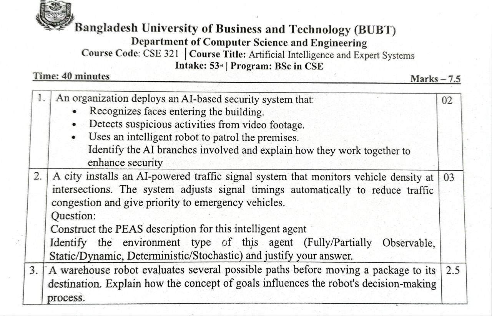

## Section 1

### 1. Scenario-based

<ins><b>Ans.:</b></ins> There are several branches of AI involved in the deployed AI-based security system.

<ins><b>Computer Vision</b></ins>

- Used for facial recognition and analyzing video footage.
- Identifies authorized persons and detects suspicious activities.

<ins><b>Machine Learning (ML)</b></ins>

- Learns patterns of normal and abnormal behavior.
- Classifies activities as safe or suspicious.

<ins><b>Robotics</b></ins>

- Controls the intelligent robot that patrols the premises.
- Enables navigation, obstacle avoidance, and autonomous movement.

Together, these AI branches provide continuous monitoring, threat detection, and rapid response, enhancing security. Here is a brief description of how they work in harmony:

- Cameras capture images and videos.
- Computer Vision recognizes faces and monitors activities.
- Machine Learning analyzes the collected data and detects unusual behavior.
- When a threat is detected, the robotics system sends the patrol robot to inspect the area and report back.

---

### 2. Scenario-based

<ins><b>Ans.:</b></ins> Here is the **PEAS description** of the AI-Powered Traffic Signal System:

<ins><b>PERFORMANCE MONITOR (P):</b></ins> Reduce traffic congestion, minimize waiting time, ensure smooth traffic flow, prioritize emergency vehicles, improve road safety.

<ins><b>ENVIRONMENT (E):</b></ins> Roads, intersections, vehicles, pedestrians, emergency vehicles, weather conditions.

<ins><b>ACTUATORS (A):</b></ins> Traffic lights (red/yellow/green signals), traffic message boards, control signals to intersections.

<ins><b>SENSORS (S):</b></ins> Cameras, vehicle detectors, road sensors, GPS data, emergency vehicle detection systems.

The environment is **Partially Observable**, **Dynamic**, and **Stochastic** for this intelligent agent.

1. <ins><b>Partially Observable</b></ins>
    - The agent cannot observe everything perfectly.
    - Sensors may miss vehicles or provide incomplete information.
2. <ins><b>Dynamic</b></ins>
    - Traffic conditions continuously change while the agent is making decisions.
    - New vehicles arrive and leave intersections at any time.
3. <ins><b>Stochastic</b></ins>
    - Traffic flow is unpredictable.
    - Accidents, weather changes, and driver behavior introduce uncertainty.

---

### 3. Conceptual

<ins><b>Ans.:</b></ins> A warehouse robot has the goal of delivering a package to its destination efficiently and safely. Here is a brief description denoting the significance of goals in its decision making:

- The robot identifies the goal (**deliver the package**).
- It generates several possible paths.
- It evaluates each path based on factors such as: **Distance, Time required, Obstacles, Safety, Energy consumption**.
- The robot selects the path that best achieves the goal.
- If conditions change (_e.g., a new obstacle appears_), it replans and chooses a better route.

The goal guides the robot's actions by helping it compare alternative paths and select the one most likely to achieve successful package delivery with minimum cost and maximum efficiency.

---

[**↪ CT Archive**](https://shadowshahriar.github.io/cse322/theory/mid/#ct-archive)
