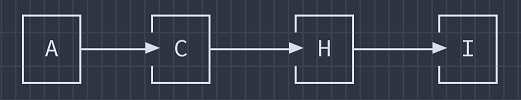

## Section 2B

<p align="center"></p>

### 1. Heuristic Math

A spelling correction system uses **Hill Climbing** search to transform a scrambled word into a meaningful word.

```
Initial state: LPAET
Goal state:    PETAL
```

At each step, we can generate neighboring states by swapping any two letters. Apply Hill Climbing (**steepest-ascent**) step by step to reach the goal. Identify whether the algorithm faces Local maxima, Plateau, or reach the goal successfully.

<ins><b>Ans.:</b></ins> We began solving it by defining a heuristic:

Heuristic, _h(n)_ = Number of letters in the correct position compared to the goal word **PETAL**.

| Position | 1   | 2   | 3   | 4   | 5   |
| :------- | --- | --- | --- | --- | --- |
| **Goal** | P   | E   | T   | A   | L   |

<ins><b>Step 1</b></ins>

Initial state: **LPAET**<br>
Goal state: **PETAL**

Comparing with goal state:

- L ≠ P
- P ≠ E
- A ≠ T
- E ≠ A
- T ≠ L

So,

```
h(LPAET) = 0
```

We generate neighbors by swapping any two letters:

From initial state **LPAET**:

| Swap            | New&nbsp;State | h                           |
| --------------- | -------------- | --------------------------- |
| L&nbsp;↔&nbsp;P | PLAET          | 1 (P correct)               |
| L&nbsp;↔&nbsp;A | APLET          | 0                           |
| L&nbsp;↔&nbsp;E | EPALT          | 1 (E correct at position 2) |
| L&nbsp;↔&nbsp;T | TPAEL          | 0                           |
| P&nbsp;↔&nbsp;A | LAPET          | 0                           |
| P&nbsp;↔&nbsp;E | LEAPT          | 0                           |
| P&nbsp;↔&nbsp;T | LTAEP          | 0                           |
| A&nbsp;↔&nbsp;E | LPEAT          | 0                           |
| A&nbsp;↔&nbsp;T | LPTEA          | 1 (T correct at position 3) |
| E&nbsp;↔&nbsp;T | LPATE          | 0                           |

```
Best heuristic value = 1
```

Choosing one of the best states. Since, we are using the steepest ascent, we select,

```
PLAET (h=1)
```

<ins><b>Step 2</b></ins>

Current state: **PLAET**<br>
Goal state: **PETAL**

Comparing with goal state:

- P ✓
- L ≠ E
- A ≠ T
- E ≠ A
- T ≠ L

So,

```
h(PLAET) = 1
```

From the state **PLAET**:

| Swap            | State | h                       |
| --------------- | ----- | ----------------------- |
| L&nbsp;↔&nbsp;E | PEALT | 2 (P and E are correct) |
| L&nbsp;↔&nbsp;T | PTAEL | 2                       |
| A&nbsp;↔&nbsp;T | PLTEA | 2                       |
| E&nbsp;↔&nbsp;T | PLATE | 2                       |
| ...             | ≤1    |                         |

```
Best heuristic value = 2
```

Choosing,

```
PEALT (h=2)
```

<ins><b>Step 3</b></ins>

Current state: **PEALT**<br>
Goal state: **PETAL**

Comparing with goal state:

- P ✓
- E ✓
- A ≠ T
- L ≠ A
- T ≠ L

```
h = 2
```

Swapping **A** and **T** leads us to **PETLA**.

Comparing with goal state:

- P ✓
- E ✓
- T ✓
- L ≠ A
- A ≠ L

```
h = 3
```

<ins><b>Step 4</b></ins>

Current state: **PETLA**<br>
Goal state: **PETAL**

Swapping **L** and **A** leads us to **PETAL**.

Compare with goal state:

- P ✓
- E ✓
- T ✓
- A ✓
- L ✓

```
h = 5
```

The goal has been reached.

<ins><b>Hill Climbing Path</b></ins>

<p align="center"></p>

At every step, a neighbor with a **higher heuristic value** exists. The heuristic continuously improves until the goal is reached. Therefore, the search **does not get stuck in a Local Maximum**.

There is **no Plateau** because the heuristic value increases along the chosen path. So, the algorithm **successfully reaches the goal state**.

---

### 2. Heuristic Math

<p align="center"></p>

<ins><b>Ans.:</b></ins> From the figure, Goal = **I**

We know that Greedy Best-First Search (**GBFS**) chooses the node with the **smallest heuristic h(n)** only.

If we start from **A**,

| Node  | h(n)  |
| ----- | ----- |
| **B** | 9     |
| **C** | _6_ ✔ |
| **D** | 8     |
| **E** | 10    |

We choose **C** (smallest `h = 6`)

Then from **C**,

| Node  | h(n)  |
| ----- | ----- |
| **G** | 4     |
| **H** | _2_ ✔ |

We choose **H** (smallest `h = 2`).

From **H**

| Node  | h(n)         |
| ----- | ------------ |
| **I** | _0_ (✔ Goal) |

We choose **I** and reach the goal.

<p align="center"></p>

**Path Cost:**

```
6 + 3 + 2 = 11
```

In constrast, **A\* Search** uses,

```
f(n) = g(n) + h(n)
```

where

- `g(n)` = actual cost from start
- `h(n)` = estimated cost to goal

If we start from **A**,

| Node  | g(n) | h(n) | f(n)   |
| ----- | ---- | ---- | ------ |
| **B** | 5    | 9    | 14     |
| **C** | 6    | 6    | _12_ ✔ |
| **D** | 7    | 8    | 15     |
| **E** | 4    | 10   | 14     |

We choose **C** (lowest `f = 12`).

From **C**,

| Node  | g(n)       | h(n) | f(n)   |
| ----- | ---------- | ---- | ------ |
| **G** | 6 + 4 = 10 | 4    | 14     |
| **H** | 6 + 3 = 9  | 2    | _11_ ✔ |

Ope nodes list:

| Node  | f      |
| ----- | ------ |
| **H** | _11_ ✔ |
| **B** | 14     |
| **E** | 14     |
| **G** | 14     |
| **D** | 15     |

We choose **H**. From **H**,

| Node  | g(n)       | h(n) | f(n) |
| ----- | ---------- | ---- | ---- |
| **I** | 9 + 2 = 11 | 0    | 11   |

Open nodes list:

| Node  | f             |
| ----- | ------------- |
| **I** | _11_ (✔ Goal) |
| **B** | 14            |
| **E** | 14            |
| **G** | 14            |
| **D** | 15            |

So, we choose **I** (Goal)

<p align="center"></p>

**Path Cost:**

```
6 + 3 + 2 = 11
```

<ins><b>Improved routing with A\* Search</b></ins>

- Greedy Best-First Search (**GBFS**) uses only `h(n)` and selects the node that appears closest to the goal. But it ignores the distance already travelled. A node may look promising but could require a very expensive route.

- **A\* Search** uses `f(n) = g(n) + h(n)` considering,
    - **g(n):** actual cost already incurred and
    - **h(n):** estimated remaining cost.

- Thus **A\* Search** balances,
    - current travel cost,
    - future estimated cost.

    This prevents the search from being misled by an attractive heuristic value alone.

<ins><b>How Admissible Heuristics Guarantee Optimality</b></ins>

A heuristic is **admissible** if: `h(n) <= h^*(n)` where `h^*(n)` is the true minimum cost from `n` to the goal. In other words, the heuristic **never overestimates** the remaining cost.

Due to that, `f(n) = g(n) + h(n)` is always a lower-bound estimate of the true solution cost. That means,

- **A\*** never ignores a potentially cheaper path.
- The first goal node removed from the `open nodes list` is guaranteed to have the minimum path cost.

Therefore, if the heuristic is **admissible** (_never overestimates the true remaining cost_), A\* is guaranteed to find the **optimal path** to the goal.

---

[**↪ CT Archive**](https://shadowshahriar.github.io/cse322/theory/mid/#ct-archive)
