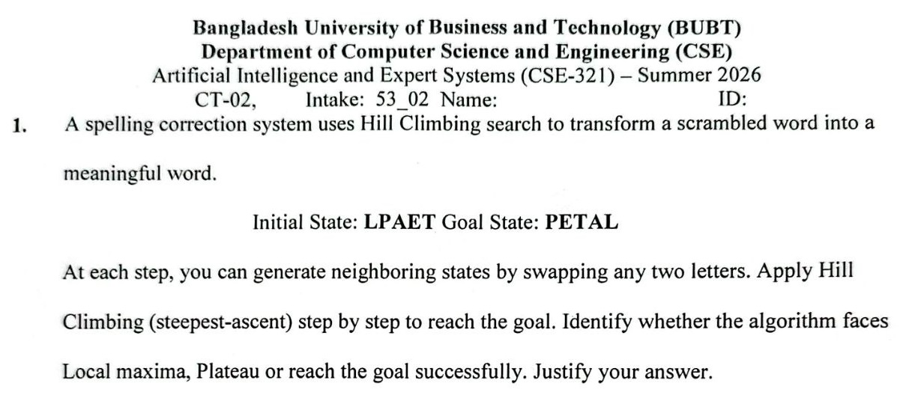
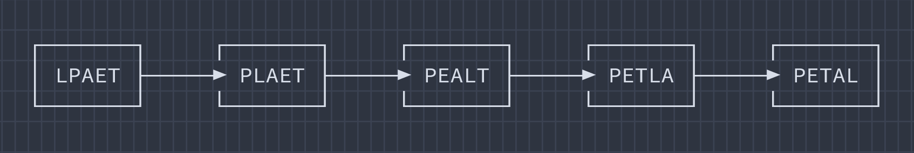

## Section 2B

<p align="center"><br></p>

### 1. Heuristic Math

A spelling correction system uses Hill Climbing search to transform a scrambled word into a meaningful word.

```
Initial state: LPAET
Goal state:    PETAL
```

At each step, we can generate neighboring states by swapping any two letters. Apply Hill Climbing (steepest-ascent) step by step to reach the goal. Identify whether the algorithm faces Local maxima, Plateau, or reach the goal successfully.

<ins><b>Ans.:</b></ins> We began solving it by defining a heuristic:

Heuristic, _h(n)_ = Number of letters in the correct position compared to the goal word **PETAL**.

| Position | 1   | 2   | 3   | 4   | 5   |
| :------- | --- | --- | --- | --- | --- |
| **Goal** | P   | E   | T   | A   | L   |

<ins><b>Step 1</b></ins>

Initial state: **LPAET**<br>
Goal state: **PETAL**

Comparing with goal state:

- L ≠ P
- P ≠ E
- A ≠ T
- E ≠ A
- T ≠ L

So,

```
h(LPAET) = 0
```

We generate neighbors by swapping any two letters:

From initial state **LPAET**:

| Swap  | New State | h                           |
| ----- | --------- | --------------------------- |
| L ↔ P | PLAET     | 1 (P correct)               |
| L ↔ A | APLET     | 0                           |
| L ↔ E | EPALT     | 1 (E correct at position 2) |
| L ↔ T | TPAEL     | 0                           |
| P ↔ A | LAPET     | 0                           |
| P ↔ E | LEAPT     | 0                           |
| P ↔ T | LTAEP     | 0                           |
| A ↔ E | LPEAT     | 0                           |
| A ↔ T | LPTEA     | 1 (T correct at position 3) |
| E ↔ T | LPATE     | 0                           |

```
Best heuristic value = 1
```

Choosing one of the best states. Since, we are using the steepest ascent, we select,

```
PLAET (h=1)
```

<ins><b>Step 2</b></ins>

Current state: **PLAET**<br>
Goal state: **PETAL**

Comparing with goal state:

- P ✓
- L ≠ E
- A ≠ T
- E ≠ A
- T ≠ L

So,

```
h(PLAET) = 1
```

From the state **PLAET**:

| Swap  | State | h                       |
| ----- | ----- | ----------------------- |
| L ↔ E | PEALT | 2 (P and E are correct) |
| L ↔ T | PTAEL | 2                       |
| A ↔ T | PLTEA | 2                       |
| E ↔ T | PLATE | 2                       |
| ...   | ≤1    |                         |

```
Best heuristic value = 2
```

Choosing,

```
PEALT (h=2)
```

<ins><b>Step 3</b></ins>

Current state: **PEALT**<br>
Goal state: **PETAL**

Comparing with goal state:

- P ✓
- E ✓
- A ≠ T
- L ≠ A
- T ≠ L

```
h = 2
```

Swapping **A** and **T** leads us to **PETLA**.

Comparing with goal state:

- P ✓
- E ✓
- T ✓
- L ≠ A
- A ≠ L

```
h = 3
```

<ins><b>Step 4</b></ins>

Current state: **PETLA**<br>
Goal state: **PETAL**

Swapping **L** and **A** leads us to **PETAL**.

Compare with goal state:

- P ✓
- E ✓
- T ✓
- A ✓
- L ✓

```
h = 5
```

The goal has been reached.

<ins><b>Hill Climbing Path</b></ins>

<p align="center"></p>

At every step, a neighbor with a **higher heuristic value** exists. The heuristic continuously improves until the goal is reached. Therefore, the search **does not get stuck in a Local Maximum**.

There is **no Plateau** because the heuristic value increases along the chosen path. So, the algorithm **successfully reaches the goal state**.

---

### 2. Heuristic Math

---

[**↪ CT Archive**](https://shadowshahriar.github.io/cse322/theory/mid/#ct-archive)
