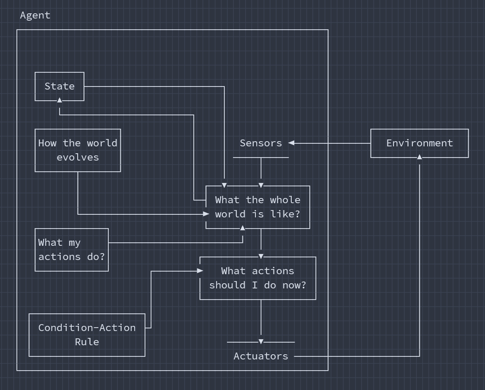
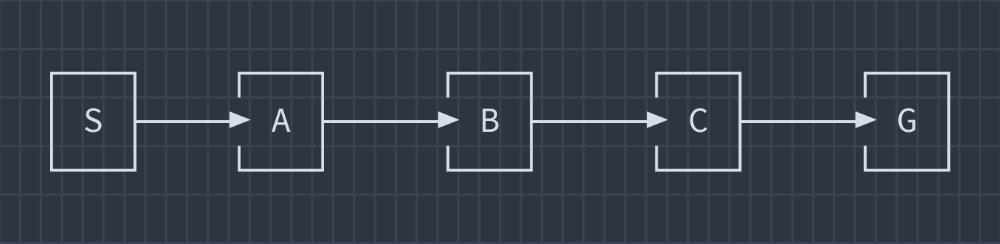

## Section 3

<p align="center"></p>

### 1(a). Scenario-based

#### i. Identify the type of intelligent agent used in this system.

<ins><b>Ans.:</b></ins> Model-Based Reflex Agent.

#### ii. Justify the answer by explaining how the characteristics and features of the system support the identified agent type.

<ins><b>Ans.:</b></ins> The **ICU patient monitoring system** is a Model-Based Reflex Agent because:

1. <ins><b>Uses sensors to perceive the environment</b></ins>
    - The system continuously collects data from sensors such as heart rate, blood pressure, oxygen level, and body temperature.
2. <ins><b>Maintains an internal state (model)</b></ins>
    - It stores each patient's previous health records and current condition.
    - This internal model helps the system understand the patient's health status over time.
3. <ins><b>Makes decisions based on current and past information</b></ins>
    - The system does not rely only on the current sensor reading.
    - It compares current data with stored patient history to detect abnormal conditions.
4. <ins><b>Performs automatic actions according to predefined rules</b></ins>
    - When oxygen level falls below a safe threshold or other abnormalities are detected, the system automatically alerts doctors and recommends appropriate actions.

<p align="center"><br><i><u>figure 1(a).: Working diagram of a Model-Based Reflex Agent.</u></i></p>

Since the system observes the environment, maintains patient history (_internal state_), and takes actions based on both current and stored information, it is best classified as a **Model-Based Reflex Agent**.

---

<p align="center"></p>

### 1(b). Uninformed Search Math

<ins><b>Ans.:</b></ins> Assuming successors are expanded from left to right.

We know, DFS explores the deepest node first.

<ins><b>Search Process</b></ins>

- Start at **S**
- Go to **A**
- From **A**, visit **B**
- From **B**, visit **C**
- From **C**, visit **G** (**Goal found**)

<p align="center"></p>

<ins><b>Path Cost</b></ins>

```
1 + 2 + 2 + 3 = 8
```

<ins><b>Expanded Nodes</b></ins>

```
S, A, B, C
```

Number of expanded nodes = **4**

Goal **G** is reached after expanding **C**.

We also know that UCS always expands the node with the **lowest cumulative path cost**.

| Step      | Frontier (Cost)       | Expanded |
| --------- | --------------------- | -------- |
| **Start** | _S_(0)                | **S**    |
| **1**     | _A_(1), _B_(4)        | **A**    |
| **2**     | _B_(3), _C_(6), G(13) | **B**    |
| **3**     | _C_(5), _G_(13)       | **C**    |
| **4**     | _G_(8), _G_(13)       | **G**    |

- Expand _S_: add _A_(1), _B_(4)
- Expand _A_(1):
    - `B=1+2=3`
    - `C=1+5=6`
    - `G=1+12=13`
- Expand _B_(3):
    - `C=3+2=5` (better than `6`)
- Expand _C_(5):
    - `G=5+3=8`
- Expand _G_(8)
    - Goal reached ✔

<p align="center"></p>

<ins><b>Path Cost</b></ins>

```
1 + 2 + 2 + 3 = 8
```

<ins><b>Expanded Nodes</b></ins>

```
S, A, B, C
```

Number of expanded nodes = **4**

Goal **G** is reached after expanding **C**.

For this graph, both algorithms return the same **path** and **cost (8)** and expand the same number of **nodes (4)**.

However, **UCS is the better algorithm** overall because it guarantees the **minimum-cost (optimal)** solution and is complete for positive edge costs.

DFS happened to find the optimal path here only because of the graph structure and expansion order; in general, DFS **does NOT guarantee the cheapest path**.

---

[**↪ CT Archive**](https://shadowshahriar.github.io/cse322/theory/mid/#ct-archive)
