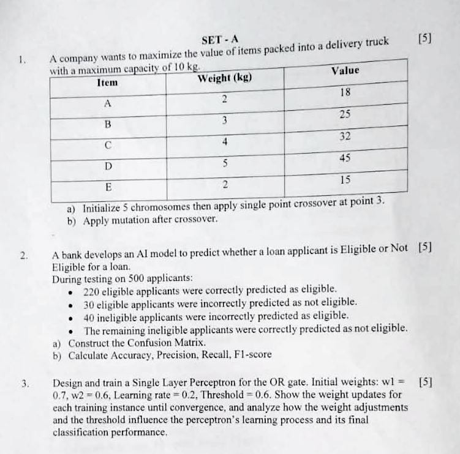
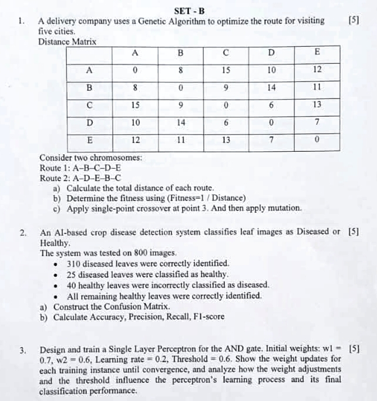
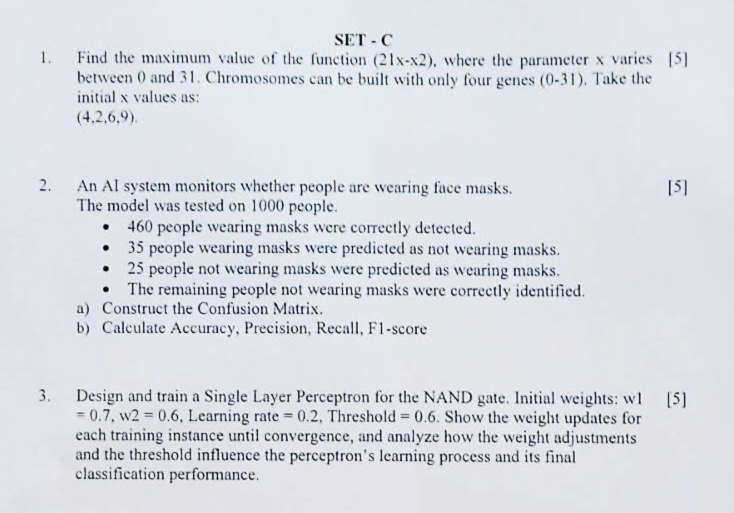
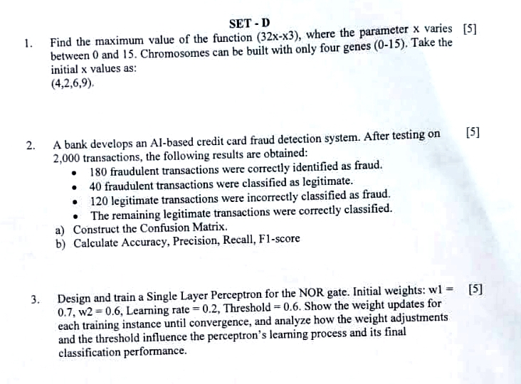

# Problem Sets

Curated by **Ifat Tamanna Metu**.<br>
Solved by **Shayan Shahriar**.

## Set A

<p align="center"></p>

### <p align="center"><ins>Ans to the Ques no. 1</ins></p>

Given here,<br>
Maximum truck capacity = **10 kg**<br>
5 items: **`A, B, C, D, E`**

#### 1. Initialize 5 chromosomes then apply single point crossover at point 3.

<ins><strong>Ans.:</strong></ins> Since there are 5 items, each chromosome has **5 binary genes**:

```
[A B C D E]
```

where:

- 1 = item is selected
- 0 = item is **NOT** selected

We initialize 5 chromosomes:

| Chromosome |   A |   B |   C |   D |   E |  Weight | Value/Fitness |
| ---------- | --: | --: | --: | --: | --: | ------: | ------------: |
| **C1**     |   1 |   1 |   0 |   0 |   1 |    7 kg |            58 |
| **C2**     |   1 |   0 |   1 |   1 |   0 | _11 kg_ |            95 |
| **C3**     |   0 |   1 |   1 |   0 |   1 |    9 kg |            72 |
| **C4**     |   1 |   0 |   0 |   1 |   1 |    9 kg |            78 |
| **C5**     |   0 |   1 |   0 |   1 |   0 |    8 kg |            70 |

Here, **C2** has a weight of **11 kg**, which exceeds the **10 kg** capacity. So, we assign it a fitness score of 0. (penalty for an infeasible solution)

| Chromosome                 | Weight | Fitness |
| -------------------------- | -----: | ------: |
| **C1**&nbsp;=&nbsp;`11001` |      7 |      58 |
| **C2**&nbsp;=&nbsp;`10110` |     11 |   **0** |
| **C3**&nbsp;=&nbsp;`01101` |      9 |      72 |
| **C4**&nbsp;=&nbsp;`10011` |      9 |      78 |
| **C5**&nbsp;=&nbsp;`01010` |      8 |      70 |

Now, a crossover at point 3 means we cut after the third gene.

```
A B C | D E
```

We consider two parents:

```
C1 = 110 | 01
C4 = 100 ∣ 11
```

and exchange the portions after point 3:

```
O1 = 110 | 01 → 11001
O2 = 100 | 01 → 10001
```

**Calculating fitness values:**

```
O1 = 11011
```

This selects:

- **A = 2 kg**, value 18
- **B = 3 kg**, value 25
- **D = 5 kg**, value 45
- **E = 2 kg**, value 15

Total weight:

```
2 + 3 + 5 + 2 = 12 kg
```

Since: `12 > 10`, it is invalid.

Its fitness can therefore be assigned **0**.

```
O2 = 10001
```

This selects **A** and **E**.

Total weight:

```
2 + 2 = 4 kg
```

Fitness value:

```
18 + 15 = 33
```

#### 2. Apply mutation after crossover.

<ins><strong>Ans.:</strong></ins> Mutation means randomly changing one or more bits. Suppose, the mutation occurs at **gene 4** of **O2**:

```
1 0 0 0 1
      ↑

1 0 0 1 1
```

```
10001 → 10011
```

Now the selected items are **A**, **D**, **E**.

Total weight:

```
2 + 5 + 2 = 9 kg
```

New fitness value:

```
18 + 45 + 15 = 78
```

### <p align="center"><ins>Ans to the Ques no. 2</ins></p>

#### 1. Construct the Confusion Matrix.

<ins><strong>Ans.:</strong></ins>

#### 2. Calculate Accuracy, Precision, Recall and F1-Score.

<ins><strong>Ans.:</strong></ins>

$$
\boxed{Accuracy=\frac{TP+TN}{Total}}
$$

$$
\boxed{Precision=\frac{TP}{TP+FP}}
$$

$$
\boxed{Recall=\frac{TP}{TP+FN}}
$$

$$
\boxed{F1=2\frac{Precision\times Recall}{Precision+Recall}}
$$

---

## Set B

<p align="center"></p>

---

## Set C

<p align="center"></p>

---

## Set D

<p align="center"></p>

---

<p align="center"><strong>The End.</strong></p>
